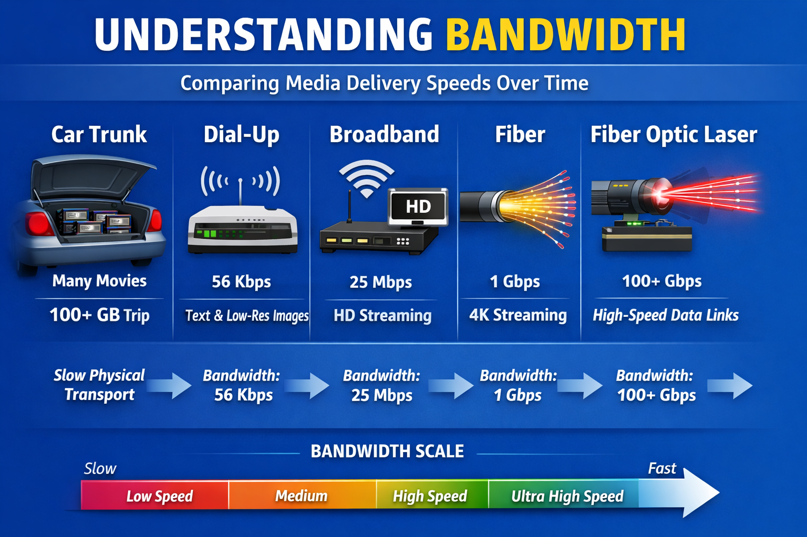

# Chapter X  
## From Blockbuster to Netflix: Why Digital Wins (Eventually)

### Learning Objectives
By the end of this chapter, you should be able to:

- Explain why digital representations can improve quality and reliability over analog systems.  
- Describe practical constraints that affect whether “better” technology is adopted.  
- Identify the infrastructure needed for large-scale digital delivery.  
- Relate digital logic concepts (thresholds, noise margin, encoding, error correction) to modern media systems.

These objectives reflect an important truth about engineering: **a technical improvement is only part of a successful system.** Digital logic gives us tools to represent and manipulate information reliably, but whether those tools reshape the world depends on economics, consumer behavior, and infrastructure.

---

## X.1 A Familiar Story That Isn’t Really About Movies

Many students have heard that Blockbuster failed because Netflix “invented streaming.” That explanation is convenient—but incomplete. Streaming video did not appear suddenly. It arrived only after years of intermediate steps, and it required a large and expensive technical ecosystem to become possible.

This chapter uses the Blockbuster-to-Netflix transition to illustrate a deeper engineering lesson:

> Digital technology tends to win not because it is automatically superior in every way, but because it becomes *scalable* and *practical* once supporting infrastructure reaches a critical point.

The story has three stages:

- **Blockbuster era:** physical distribution, analog-to-digital media formats  
- **Netflix-by-mail era:** digital selection, physical delivery  
- **Streaming era:** fully digital delivery, dependent on broadband and global infrastructure  

We will treat each stage as a system—because in engineering, systems win or lose based on constraints.

---

## X.2 Blockbuster: A System Optimized for the Physical World

Blockbuster Video was not merely a store. It was a carefully engineered distribution system for an era in which the internet could not reliably deliver large media files. If a household wanted a movie, the fastest and most dependable way to get it was to transport a physical object from a shelf to a living room.

A Blockbuster-style system can be described in terms that resemble computer architecture:

- **Storage:** shelves of tapes or discs  
- **Distribution nodes:** local stores near customers  
- **Latency:** driving time  
- **Bandwidth:** how many items can be carried per trip  
- **Reliability:** high, because playback does not depend on network connectivity  
- **Failure modes:** out-of-stock inventory, damaged tapes, late returns  

These bullet points are more than a metaphor. They show that Blockbuster solved the “content delivery” problem using *physical analogs* of digital concepts. A local store acts like a cache. Shelves act like storage. The car ride acts like a data link. The store inventory system acts like a resource scheduler.

Most importantly, Blockbuster matched the constraints of the era. In the 1990s, home internet was slow, inconsistent, and often billed by the minute. Even if a movie could be digitized, it could not be transmitted efficiently. Blockbuster therefore represents a system optimized for a world in which **physical transport is the highest-bandwidth network available to most consumers.**

---

## X.3 VHS vs DVD: The First Major Digital Quality Leap

Blockbuster’s business model did not collapse immediately because Netflix had a better idea. It began to erode because the underlying media technology shifted. That shift started with a consumer-facing transition that students may not recognize as a digital logic milestone: the move from VHS to DVD.

### X.3.1 Analog Video: Continuous Signals and Gradual Degradation

VHS is an analog format. In an analog system, information is represented by continuously varying physical quantities. In the case of VHS, video is stored as variations in a magnetic signal along a tape.

Analog systems have a distinctive behavior:

> As noise increases, quality degrades gradually.

A worn VHS tape still “works,” but the image becomes noisier, less stable, and less faithful. Copies of VHS tapes degrade quickly because the copying process introduces new noise. Each generation of copying adds additional distortion.

From the perspective of engineering, analog systems are intuitive: the signal is a physical object, and its imperfections show up as physical artifacts. But they are difficult to protect against degradation, because small changes in the physical medium become small changes in the reproduced signal.

### X.3.2 Digital Video: Bits, Thresholds, and Consistency

DVDs store video digitally. Instead of recording a continuously varying waveform, a DVD stores bits—discrete symbols such as 0 and 1. A DVD player does not “reproduce the signal” in the analog sense. Instead, it reads data and reconstructs the content algorithmically.

Digital representation enables two major improvements:

- **Repeatability:** playback quality is consistent across time  
- **Perfect copying:** copies can be identical to originals  

These are not merely consumer conveniences. They are consequences of digital logic. In a digital system, the receiver interprets signals using **thresholds**. As long as the physical signal remains within acceptable margins, the recovered bit is correct. This is the basis of **noise margin**, one of the central concepts in digital design.

This leads to a powerful advantage:

> Digital systems can tolerate noise without changing the recovered information—until noise exceeds a threshold.

That “until” is important. Analog systems degrade gradually. Digital systems often degrade suddenly. A DVD is flawless until it isn’t. A small scratch might be corrected invisibly, but a larger scratch can cause freezing, skipping, or failure. This is sometimes called the **cliff effect** and is a recurring theme in digital engineering.

DVDs also introduced many students’ first exposure to “invisible digital machinery”:

- **Compression** allows long movies to fit on the disc  
- **Error correction** allows scratched discs to play reliably  

These are the same kinds of tools used in modern networks and computer systems. In other words, DVDs were not just "better tapes." They were early examples of end-to-end digital systems engineering.

---

## X.4 Why Digital Quality Alone Didn't Replace Blockbuster

If digital video is more consistent and robust, why didn’t the world instantly move to digital delivery?

Because digital representation is not the same as digital distribution.

DVDs improved quality while keeping the distribution system unchanged. Consumers still drove to a store and rented a physical disc. This matters because adoption depends on the following practical realities:

- **Cost:** new devices must be affordable  
- **Convenience:** new systems must reduce friction  
- **Compatibility:** systems must work with existing TVs and habits  
- **Infrastructure:** distribution must be possible at scale  

DVDs succeeded because they improved the experience without requiring a new ecosystem. Streaming video required a new ecosystem, so it could not dominate until that ecosystem existed.

This is a key adoption principle:

> A new technology spreads fastest when it provides clear benefits without demanding large behavioral change.

---

## X.5 Netflix v1: Digital Convenience, Physical Delivery

Netflix’s early success did not come from streaming. It came from recognizing that while the internet could not deliver movies efficiently, it could deliver something else extremely valuable: **information**.

Netflix digitized the *store experience* before it digitized the *movie delivery*.

Netflix’s system had two parts:

- **Digital control plane:** browsing, ordering, queue management, recommendations  
- **Physical data plane:** DVDs delivered by mail  

This separation is one of the most important system design ideas in modern computing. The control plane can be lightweight and responsive, even when the data plane is heavy and slow.

Netflix’s website allowed customers to browse a huge catalog without driving anywhere. It allowed personalized recommendations and search. Most importantly, it made selecting a movie easy and low-effort. The customer no longer interacted with shelves and inventory constraints. Instead, they interacted with a digital interface.

Then Netflix solved the delivery problem using existing infrastructure: the postal service. Instead of building thousands of stores, Netflix built warehouses and relied on USPS as the last-mile delivery network. This was not just clever business. It was clever engineering: it reused an already-optimized distribution system rather than constructing a new one.

In hindsight, Netflix-by-mail looks like a transitional technology. But transitional technologies are often the ones that reshape society because they bridge what is *possible now* with what is *inevitable later*.

---

## X.6 Streaming Video: A Digital System That Needed the World to Change

Streaming video seems simple: press play, watch instantly. But from an engineering standpoint, streaming is one of the most demanding consumer technologies ever deployed. It requires a complete end-to-end digital pipeline.

Streaming dominance required at least five developments:

- better **compression**  
- widespread **broadband**  
- distributed infrastructure (**CDNs**)  
- powerful consumer **devices**  
- workable **licensing and DRM**  

Each of these deserves explanation.

### X.6.1 Compression: Trading Computation for Bandwidth

Raw video is enormous. If a movie were sent uncompressed, it would overwhelm consumer internet connections. Streaming became practical only because video codecs improved dramatically. These codecs exploit redundancy and perceptual limits: they remove information that the human eye is less likely to notice.

Compression is a quintessential digital idea. Once content becomes bits, it can be transformed algorithmically. The system can trade one resource (computation) for another (bandwidth). This is exactly the kind of tradeoff engineers make in digital design: time vs space, gates vs memory, throughput vs complexity.

### X.6.2 Broadband: The Consumer-Side Constraint

Even with compression, streaming depends on consumer connectivity. Streaming could not dominate until broadband was common and reliable. A system that works only for a small fraction of users cannot become the standard. This is why streaming adoption lagged behind the invention of digital video.

In a digital logic course, it is useful to emphasize that "digital" does not mean "instant." A digital system is only as strong as its weakest link. If the channel is poor, the system must either adapt or fail.

### X.6.3 CDNs: Digital Caching at Global Scale

One of the most important streaming technologies is the content delivery network (CDN). CDNs store copies of popular content near users, reducing load on central servers and reducing network congestion.

This is the streaming equivalent of Blockbuster’s local store inventory. Blockbuster kept popular movies near customers. CDNs keep popular data near customers. The system principle is identical: **cache near demand**.

This parallel is useful for students because it shows continuity. Streaming did not "defeat" Blockbuster's model so much as it digitized it.

---

## X.7 Digital Quality Improvements—and Digital Failure Modes

Once streaming became viable, it unlocked enormous benefits:

- higher resolution (HD, 4K, HDR)  
- better audio formats  
- instant access  
- consistent playback without physical wear  
- personalization and recommendations  

However, digital systems introduce new failure modes:

- buffering  
- bitrate drops  
- connection instability  
- platform fragmentation  
- content removal due to licensing  

This is another engineering lesson:

> Digital systems don’t eliminate problems. They replace familiar problems with new ones.

A scratched DVD is visible and understandable. Buffering is invisible and frustrating. Both are failures, but they belong to different layers of the system.

---

## X.8 Conclusion: Digital Wins When the Whole System Exists

The transition from Blockbuster to Netflix illustrates a foundational truth of engineering:

> The superiority of digital representation is not enough. Digital must be deliverable, scalable, and supported by infrastructure.

DVDs were digital quality improvements delivered through physical distribution. Netflix-by-mail digitized the customer experience while retaining physical delivery. Streaming completed the transformation, but only after compression, broadband, and distributed networks made it feasible.

The digital revolution is not just about 1s and 0s. It is about building reliable systems that move information through imperfect channels, at global scale, with real constraints.

That is why digital wins—eventually.

---

## Review Questions
1. Why does digital video allow perfect copying while analog video does not?  
2. What is the cliff effect, and why does streaming exhibit it?  
3. Why did Netflix begin with mailed DVDs instead of streaming?  
4. How do CDNs function like Blockbuster stores?  
5. Name three infrastructure developments that were required for streaming dominance.

