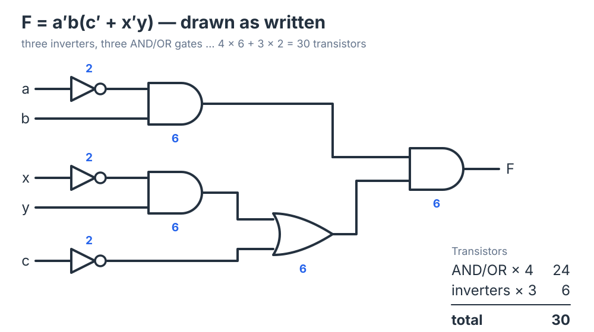
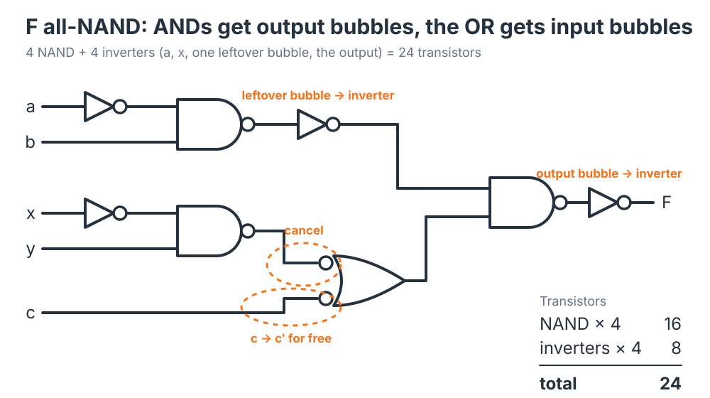
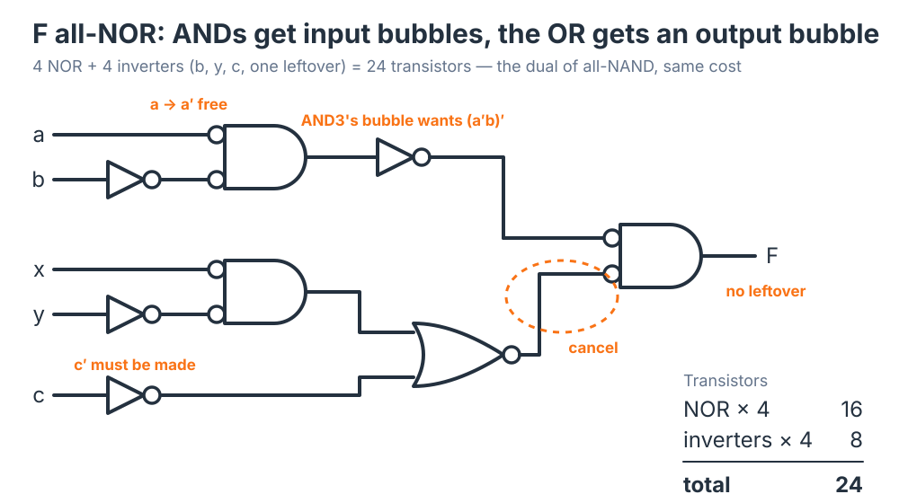
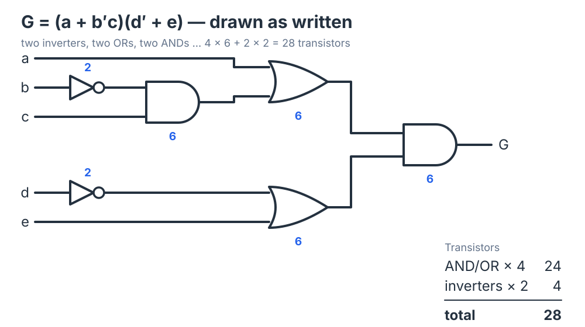
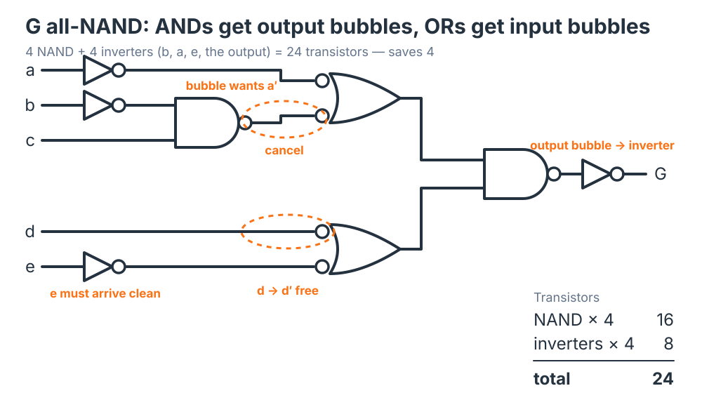
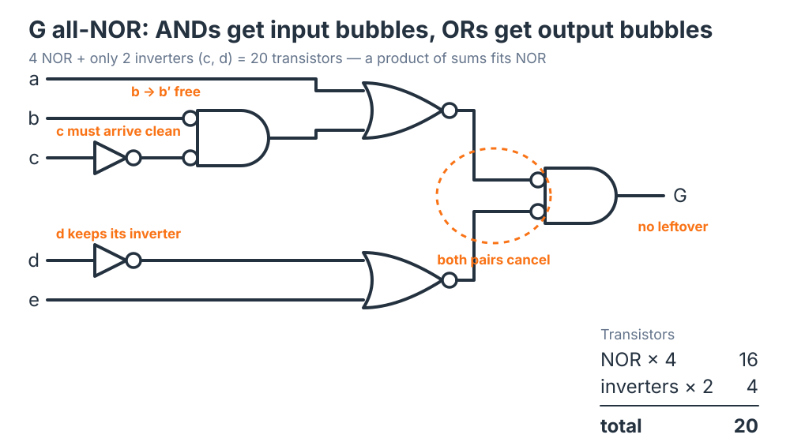

## All-NAND and All-NOR Realizations

NAND and NOR are **universal gates**: either one, on its own, can build any Boolean function. That means a circuit you have drawn the natural way — a mix of AND gates, OR gates, and inverters — can always be rebuilt using *only* NAND gates and inverters, or *only* NOR gates and inverters. This section shows the technique for doing that conversion directly on the schematic, without reworking the algebra first, and then asks the obvious question: if the function is the same either way, why bother? The answer is **transistor count**. Done well, an all-NAND or all-NOR realization uses fewer transistors than the literal AND/OR/inverter build, which is exactly why real hardware is dominated by these two gates. The video works four examples end to end; the text below follows the same four and adds the counts, a check, and the Verilog.

The method is **bubble pushing** — a graphical form of De Morgan's theorem. Rather than manipulating symbols on paper, you redraw each gate and slide inversion bubbles along the wires until everything is consistent. The goal throughout is to keep the **shape-distinctive symbols** (the curved-back OR shape, the flat-backed AND shape) so that the diagram still *reads* as the original logic even after every gate has quietly become a NAND or a NOR.

## The Two Faces of a Gate

De Morgan's theorem says $\overline{A \cdot B} = \bar{A} + \bar{B}$ and $\overline{A + B} = \bar{A}\cdot\bar{B}$. Read graphically, each identity gives a single gate **two equivalent drawings**:

- A **NAND** is an AND shape with a bubble on the output, *and equally* an OR shape with bubbles on both inputs.
- A **NOR** is an OR shape with a bubble on the output, *and equally* an AND shape with bubbles on both inputs.

"Pushing a bubble" through a gate is just switching between these two drawings: the bubble moves from one side to the other, and the body of the symbol flips between AND shape and OR shape. The gate never changes — only the picture does.

That gives a compact set of conversion rules. To rebuild a circuit out of one gate type, replace each AND and OR with the matching universal-gate drawing:

| Original gate | As a NAND | As a NOR |
|---|---|---|
| AND | AND shape, bubble on the **output** | AND shape, bubbles on the **inputs** |
| OR | OR shape, bubbles on the **inputs** | OR shape, bubble on the **output** |

In every case the *shape* you draw still matches the function you intend (AND shape for a product, OR shape for a sum); only the bubbles tell you it is physically a NAND or a NOR.

## Matching the Bubbles

Replacing the gates sprinkles bubbles all over the schematic, and every one of them has to be accounted for so the function comes out unchanged. The bookkeeping rule is simple: **a bubble is an inversion, and two inversions cancel.** Walking each wire from a gate's output to the next gate's input, three situations come up:

- **Bubble meets bubble.** An output bubble feeding an input bubble is a double inversion — they cancel, and the signal passes through clean. This is where the efficiency comes from: inversions you added pay for each other.
- **A complement is needed.** If the original wire carried $\bar{x}$, you can often get it for free by routing $x$ straight into a bubble — it emerges complemented.
- **An unwanted bubble is left over.** If a signal must arrive (or leave) *uncomplemented* but a lone bubble is in the way, cancel it with an **inverter**. The final output is the common case: we want $F$, not $\bar{F}$, so a leftover output bubble gets one last inverter.

With the rules and the matching in hand, the rest is mechanical. The four examples below all start from the same place — the function drawn the natural way with AND gates, OR gates, and inverters — and convert it twice: once to all-NAND, once to all-NOR.

## Example 1 — $F$ with NAND Gates

$$F = \bar{a}\,b\,(\bar{c} + \bar{x}\,y)$$

Implement it **exactly as written**, no algebraic simplification. Reading the expression by Boolean precedence gives the natural circuit:

- An AND gate forms the product $\bar{a}\,b$ (an inverter on $a$ supplies $\bar{a}$).
- An AND gate forms the product $\bar{x}\,y$ (an inverter on $x$ supplies $\bar{x}$).
- An OR gate forms the sum $\bar{c} + \bar{x}\,y$ (an inverter on $c$ supplies $\bar{c}$).
- A final AND gate forms $F = \bar{a}\,b \cdot (\bar{c} + \bar{x}\,y)$.



Now convert. Every AND becomes an AND-shape NAND with an output bubble; the OR becomes an OR-shape NAND with input bubbles. Then match the bubbles wire by wire:

1. The $\bar{x}y$ NAND's output bubble lands on an input bubble of the OR-shape NAND — **cancel**; the OR receives $\bar{x}y$ clean.
2. The OR's other input bubble is fed $c$ directly, which emerges as $\bar{c}$ — the **inverter on $c$ is no longer needed**.
3. The $\bar{a}b$ NAND's output bubble feeds the final AND-shape NAND, which has no input bubble to cancel it — insert an **inverter**.
4. The final NAND's output bubble would deliver $\bar{F}$ — insert an **inverter** to get $F$.

The result is the identical function built entirely from NAND gates and inverters, with the AND and OR shapes still visible: four NANDs, and four inverters ($a$, $x$, the $\bar{a}b$ wire, and the output).



**Why it is cheaper.** In CMOS an inverter costs 2 transistors and a two-input NAND or NOR costs 4. An ordinary AND or OR does not exist on its own — it is a NAND/NOR *followed by an inverter*, $4 + 2 = 6$ transistors. Count the natural build against the all-NAND build:

| Realization | Gates | Inverters | Transistors |
|---|---|---|---|
| AND/OR/inverter | $4 \times 6 = 24$ | $3 \times 2 = 6$ | **30** |
| All-NAND | $4 \times 4 = 16$ | $4 \times 2 = 8$ | **24** |

The all-NAND version saves **6 transistors**. The four gates dropped their hidden output inverters (8 transistors), the $c$ inverter vanished into a bubble (2 more), and two explicit inverters came back (4) — net 6 ahead.

This is worth holding as a **level-of-abstraction** idea. You normally *think and design* at the AND/OR level because that is how the function reads, while keeping in mind that the same circuit maps onto a leaner all-NAND form. You do not have to draw the all-NAND version everywhere — but knowing the mapping exists is what lets a synthesis tool, and the silicon, implement it cheaply.

**Checking the conversion.** Bubble matching is easy to get subtly wrong — a bubble missed or counted twice gives the complement of a term. The check is the one you already trust: a truth table, or the same comparison done by a simulator. The Verilog at the end of this section does exactly that for Example 1, exhaustively.

## Example 2 — $F$ with NOR Gates

Take the same $F$ and the same starting AND/OR/inverter circuit, but push the bubbles the other way. Now each AND becomes an AND-shape NOR with **input** bubbles, and the OR becomes an OR-shape NOR with an **output** bubble. Match as before: an input bubble already sitting where a complement is wanted ($\bar{a}$, for example) does that job for free; where a NOR's input has no bubble but the wire needs one (as for $\bar{c}$), insert an inverter to form it. One more inverter appears on the $\bar{a}b$ wire: the final AND shape's input bubble wants $\overline{\bar{a}b}$, and the product gate delivers $\bar{a}b$ uninverted. At the other input the OR shape's output bubble lands on the AND shape's input bubble and cancels, and the output comes out clean — no inverter needed there.



The transistor count comes out the same as the all-NAND version:

| Realization | Gates | Inverters | Transistors |
|---|---|---|---|
| All-NOR | $4 \times 4 = 16$ | $4 \times 2 = 8$ | **24** |

This **duality** between NAND and NOR is no surprise — you generally expect the same answer from an all-NOR realization as from an all-NAND one. As the next pair of examples shows, the tie breaks only when the *shape* of the expression favors one universal gate over the other.

## Example 3 — $G$ with NAND Gates

$$G = (a + \bar{b}\,c)(\bar{d} + e)$$

Lay it out by Boolean precedence again. The product $\bar{b}\,c$ is formed first (an inverter gives $\bar{b}$), then OR'd with $a$ to make $a + \bar{b}\,c$. Separately an OR makes $\bar{d} + e$ (an inverter gives $\bar{d}$). A final AND multiplies the two sums to produce $G$.



Convert to NAND exactly as in Example 1 — ANDs get output bubbles, ORs get input bubbles — then match: $\bar{b}$ and $c$ feed the first NAND as before; $\bar{d}$ comes free by routing $d$ into a bubble; $e$ needs its bubble cancelled so it arrives uncomplemented; $a$ needs an inverter for the same reason; and the final output needs an inverter to deliver $G$ instead of $\bar{G}$.



| Realization | Gates | Inverters | Transistors |
|---|---|---|---|
| AND/OR/inverter | $4 \times 6 = 24$ | $2 \times 2 = 4$ | **28** |
| All-NAND | $4 \times 4 = 16$ | $4 \times 2 = 8$ | **24** |

The all-NAND build saves **4 transistors** here — less than in Example 1, because $G$'s two sums each need an input bubble undone.

## Example 4 — $G$ with NOR Gates

Now convert the same $G$ to all-NOR: ANDs get input bubbles, ORs get output bubbles. This time the matching falls out unusually cleanly. Input $b$ routed into a bubble gives $\bar{b}$; $c$ needs its bubble cancelled; $d$ simply keeps the inverter it already had, since the OR shape it feeds has no input bubble; and both OR shapes' output bubbles land on the final AND shape's input bubbles and cancel on their own. Only **two** inverters are needed in the whole circuit, and the output needs none.



| Realization | Gates | Inverters | Transistors |
|---|---|---|---|
| All-NOR | $4 \times 4 = 16$ | $2 \times 2 = 4$ | **20** |

At **20 transistors**, this is the leanest of all four realizations. The reason is structural: $G = (a + \bar{b}\,c)(\bar{d} + e)$ is a **product of sums**, and NOR gates fit a product of sums the way NAND gates fit a sum of products. When the expression's form matches the gate, fewer bubbles need undoing, so fewer inverters are added. The rule of thumb:

- **Sum of products → all-NAND** is natural.
- **Product of sums → all-NOR** is natural.

All four counts side by side:

| | AND/OR/inverter | All-NAND | All-NOR |
|---|---|---|---|
| $F = \bar{a}\,b\,(\bar{c} + \bar{x}\,y)$ | 30 | **24** | 24 |
| $G = (a + \bar{b}\,c)(\bar{d} + e)$ | 28 | 24 | **20** |

Both universal-gate builds beat the literal build every time; which of the two wins depends on the expression's shape.

## In Verilog

You would normally describe the *behavior* and let the synthesizer choose gates — and it reaches for NAND and NOR for exactly the transistor reasons above:

```verilog
// Same functions, described behaviorally.
assign F = ~a & b & (~c | (~x & y));   // F = a'·b·(c' + x'·y)
assign G = (a | (~b & c)) & (~d | e);  // G = (a + b'·c)·(d' + e)
```

A structural description makes the universal gate explicit. This is Example 1's all-NAND circuit, gate for gate — four `nand` primitives and four `not` primitives, in the order the bubble matching produced them:

```verilog
module f_nand(input a, b, c, x, y, output F);
  wire a_n, x_n, n1, n1_n, n2, n3, n4;
  not  (a_n, a);            // inverter: a'
  not  (x_n, x);            // inverter: x'
  nand (n1, a_n, b);        // n1 = (a'·b)'          AND-shape NAND, output bubble
  nand (n2, x_n, y);        // n2 = (x'·y)'          AND-shape NAND, output bubble
  nand (n3, c, n2);         // n3 = c' + x'·y        OR-shape NAND: its input bubbles
                            //                       make c' and cancel n2's bubble
  not  (n1_n, n1);          // inverter: cancel n1's leftover output bubble
  nand (n4, n1_n, n3);      // n4 = (a'·b · (c' + x'·y))'
  not  (F, n4);             // inverter: deliver F, not F'
endmodule
```

Read the comments against the bubble-matching steps and they line up one to one: `n3` is the OR-shape NAND whose input bubbles supply $\bar{c}$ for free and cancel `n2`'s output bubble, and the two `not` gates at the end are the two leftover bubbles. A testbench that instantiates this module beside the behavioral `assign` and steps all 32 input combinations reports zero mismatches — that is the truth-table check, done by the simulator, and it is how you should confirm any bubble-pushed circuit before trusting it.

The point is not the exact netlist but the mapping: every AND/OR/inverter diagram has an all-NAND and an all-NOR twin, and the universal-gate twin is usually the cheaper one to fabricate.

## Key Takeaways

NAND and NOR are universal, so any AND/OR/inverter circuit can be rebuilt from one gate type plus inverters. The conversion is done graphically by **bubble pushing** — De Morgan's theorem drawn on the page — in which each AND or OR is replaced by the matching universal-gate symbol (AND→NAND adds an output bubble, OR→NAND adds input bubbles; AND→NOR adds input bubbles, OR→NOR adds an output bubble) while the shape-distinctive symbols are kept so the diagram still reads correctly. Bubbles are then **matched** along each wire: paired bubbles cancel, a bubble can supply a needed complement for free, and a leftover bubble is removed with an inverter. The reason to do any of this is **transistor count**: an ordinary AND/OR is a NAND/NOR plus a wasted output inverter (6 transistors versus 4), so the universal-gate realization sheds those inverters — $F$ dropped from 30 to 24. All-NAND and all-NOR are dual and usually tie, but the **shape of the expression breaks the tie**: sum of products favors all-NAND, product of sums favors all-NOR, which is why $G$'s all-NOR build reached 20. Check every conversion with a truth table or a simulation.

## Review Questions

### Question 1

What does it mean to call NAND and NOR "universal" gates?

A. They are the fastest gates available in CMOS\
B. Either gate alone can implement any Boolean function\
C. They require no transistors to build\
D. They can only implement sum-of-products expressions

### Question 2

To convert an OR gate into a NAND while keeping its shape-distinctive symbol, where do the bubbles go?

A. One bubble on the output\
B. Bubbles on the inputs\
C. No bubbles are needed\
D. One bubble on each input and one on the output

### Question 3

During bubble matching, an output bubble feeds directly into an input bubble on the next gate. What happens?

A. The signal is inverted once\
B. An extra inverter must be added\
C. The two bubbles cancel and the signal passes through unchanged\
D. The circuit becomes invalid

### Question 4

Why does an all-NAND realization generally use fewer transistors than the literal AND/OR/inverter version of the same function?

A. NAND gates use fewer transistors than inverters\
B. The AND/OR build needs output inverters (each AND/OR is a NAND/NOR plus an inverter) that the all-NAND build sheds\
C. NAND gates do not need a power supply\
D. Bubble pushing deletes gates from the circuit

### Question 5

In Example 1, the inverter on $c$ from the natural circuit disappeared in the all-NAND version. Why?

A. $\bar{c}$ was no longer needed\
B. The OR-shape NAND's input bubble inverts $c$ for free, so routing $c$ straight in supplies $\bar{c}$\
C. The inverter was merged into the final output inverter\
D. NAND gates ignore inverted inputs

### Question 6

Why did the all-NOR realization of $G = (a + \bar{b}\,c)(\bar{d} + e)$ come out the most efficient, at 20 transistors?

A. NOR gates are always cheaper than NAND gates\
B. The expression is a product of sums, a form that NOR gates fit with the fewest added inverters\
C. The function was algebraically simplified first\
D. All-NOR circuits never need inverters

### Question 7

After converting a circuit by bubble pushing, what is the reliable way to confirm it still computes the original function?

A. Count the gates — the count must be unchanged\
B. Compare truth tables, by hand or by simulating both circuits over every input combination\
C. Check that every gate has a bubble\
D. Confirm the transistor count went down

## Answer Explanations

**1. B.** A universal gate can, by itself, build any Boolean function. Both NAND and NOR qualify, which is what lets an entire circuit be rebuilt from a single gate type plus inverters.

**2. B.** By De Morgan's theorem $A + B = \overline{\bar{A}\cdot\bar{B}}$, so an OR equals a NAND whose inputs are complemented — an OR shape with bubbles on the inputs. Keeping the OR shape preserves the visual meaning while the input bubbles make it physically a NAND.

**3. C.** A bubble is an inversion, and two inversions in series cancel. An output bubble meeting an input bubble is a double inversion, so the signal passes through unchanged — this free cancellation is the source of the transistor savings.

**4. B.** An ordinary AND or OR gate is physically a NAND or NOR followed by an inverter (6 transistors versus 4). Building directly from the universal gate removes those hidden output inverters; only a few explicit inverters are added back to fix leftover bubbles, so the total drops.

**5. B.** The OR became an OR-shape NAND, which has a bubble on each input. Feeding $c$ into that bubble produces $\bar{c}$ on the far side, so the separate inverter is redundant. (In the all-NOR version the same input has no bubble, and the inverter has to come back — which is why the two counts differ in where the inverters sit, not in how many.)

**6. B.** All-NAND and all-NOR realizations are dual and usually tie, but the shape of the expression breaks the tie. $G$ is a product of sums, the form NOR gates match naturally, so the bubbles line up with the fewest added inverters — only two — giving the leanest 20-transistor build.

**7. B.** Equivalence of two Boolean circuits is decided by their truth tables. Simulating both — the behavioral expression and the structural netlist — over all $2^n$ inputs and comparing outputs is the same check done by machine; the Verilog in this section does it for Example 1 with zero mismatches.
