## Basic Circuits: From Ohm's Law to Logic

### Learning Objectives

By the end of this section, you should be able to:

- Identify the three elements of a simple single-loop circuit — a voltage source, a resistor, and a load — and explain the role each one plays.
- Apply Ohm's law ($V = I \cdot R$) and Kirchhoff's voltage law to relate the voltage, current, and resistance in a loop.
- Predict how the current and the brightness of an LED change as the series resistance is varied, and explain why a current-limiting resistor is necessary.
- Distinguish a **series** connection (shared current) from a **parallel** connection (shared voltage).
- Reinterpret series and parallel topologies with switches and use **continuity** to show that series corresponds to logical **AND** and parallel to logical **OR**.
- Explain why this series-AND / parallel-OR mapping is the bridge from circuit theory to building logic gates out of transistors.

---

## Why a Little Circuit Theory?

Digital logic is usually taught at the level of gates, truth tables, and Boolean algebra — abstractions that deliberately hide the underlying electronics. That abstraction is powerful, but it rests on a physical foundation, and a small amount of circuit theory is enough to make that foundation solid. We do not need a full course in circuit analysis. We need just two ideas: how voltage, current, and resistance relate in a simple loop, and what it means to connect components in **series** versus in **parallel**. Everything else in this section is built from those two ideas, and by the end we will see that they lead directly to the structure of logic gates.

---

## The Single-Loop Circuit

The simplest useful circuit is a single loop: a source of energy connected to something that uses it, with a resistor in between. We will build one out of three parts.

The first part is a **voltage source**. Picture a battery. A single cell might supply about $1.5$ V, but for digital work it is convenient to idealize the source to a round number — we will call it $5$ V. (Five volts is the classic supply voltage of older digital logic; modern chips run at lower voltages, but $5$ V remains a clean teaching value.) The defining feature of a voltage source is that it holds its voltage **constant**, no matter what we attach to it.

The second part is a **resistor**. Its job in this circuit is to *control the current*. We will see in a moment exactly why that control matters.

The third part is the **load** — the thing we actually want to operate. Here the load is an **LED**, a *light-emitting diode*. An LED is drawn with the standard diode symbol (a triangle pointing into a bar), sometimes with a small circle around it to mark it as light-emitting. The LED is a good choice for a first example because its brightness is a direct, visible readout of the current flowing through it: more current, brighter light.

Connecting these three parts end to end forms a single loop:

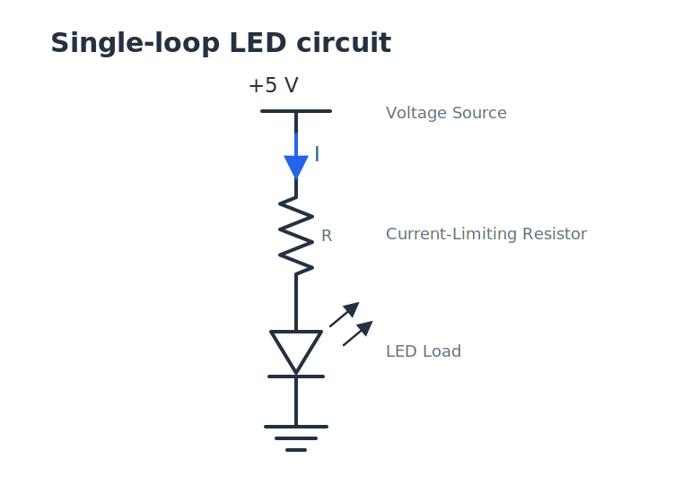

---

## Ohm's Law and the Loop

Two relationships govern this loop. The first is **Ohm's law**, which ties together the three quantities we care about:

$$V = I \cdot R$$

Here $V$ is the voltage across a resistor, $I$ is the current through it, and $R$ is its resistance. The second relationship is **Kirchhoff's voltage law (KVL)**, which says that if you travel all the way around a closed loop, the voltage *rises* and *drops* must cancel out — you end up back where you started, at the same potential.

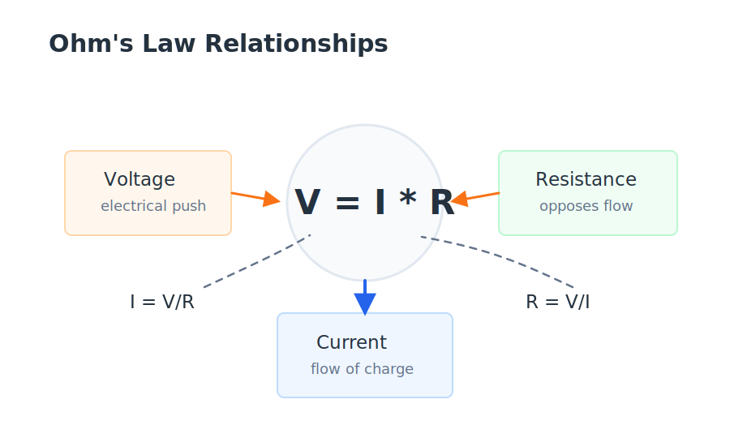

Apply KVL to our loop. Starting at the bottom and going up through the source, the voltage **rises** by $V$ (the full $5$ V). Coming back down through the resistor, the voltage **drops** by $I \cdot R$. To keep the example simple, we will assume the LED itself drops $0$ V. (That is not exactly true — a real LED drops something like $1.8$–$3$ V — but it is close enough to see the main idea.) With that simplification, the rise must equal the drop:

$$V = I \cdot R$$

This is the same equation as Ohm's law, which is no accident: in a single loop with one resistor, the source voltage appears entirely across that resistor.

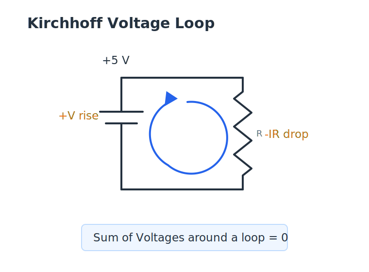

The crucial move is to **solve for the current**, because in this circuit the voltage is the fixed quantity and the resistance is the knob we turn:

$$I = \frac{V}{R}$$

With $V$ held constant by the source, the current is determined entirely by $R$.

---

## Varying the Load

Now experiment with the resistor. Because $I = V/R$ and $V$ is fixed, the current and the resistance move in opposite directions:

| Action on $R$ | Effect on $I = V/R$ | Effect on the LED |
|---------------|---------------------|-------------------|
| Increase $R$  | $I$ decreases       | LED dims          |
| Decrease $R$  | $I$ increases       | LED brightens     |

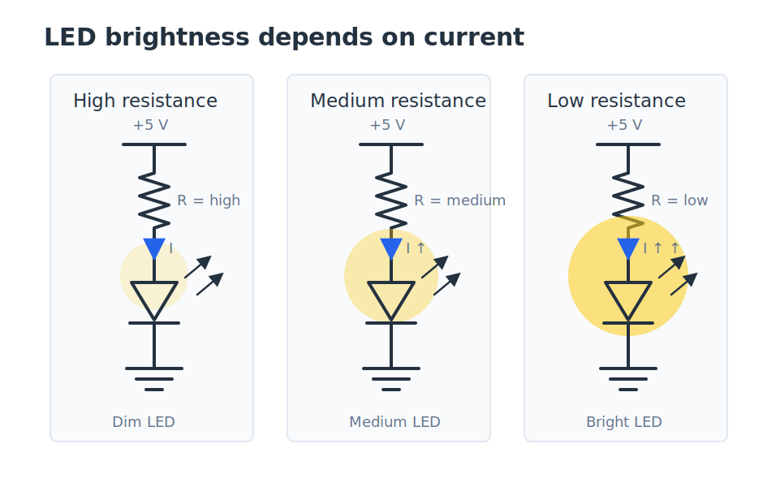

Make the resistance large and you choke off the current, and the LED grows dim. Make the resistance small and you let more current through, and the LED glows brighter. This inverse relationship is the whole behavior of the loop.

It also answers a natural question: *why have a resistor at all?* Suppose we removed it — set $R = 0$. Then $I = V/R = 5\text{ V} / 0$, which the math says is infinite current. In reality the current does not literally become infinite; instead the excessive current destroys the LED ("blows up the diode"). The resistor exists precisely to **limit the current** to a safe level. A resistor used this way is called a **current-limiting resistor**, and it is one of the most common building blocks in practical electronics.

One more idea is worth naming, because it returns later. We held the *source* constant and varied the *load*. When we get to logic gates, we will study **ideal** gates in which the loading does not affect the output at all — an idealization that lets us reason about logic without worrying about these circuit details. The single-loop circuit is where the habit of "constant source, variable load" first appears.

---

## Series and Parallel

The single loop had its parts strung one after another. That arrangement — components connected end to end so that the **same current** flows through each — is called a **series** connection. There is a second fundamental way to connect components, called **parallel**, and the contrast between the two is the second idea we need.

### Series: shared current

Place two resistors, $R_1$ and $R_2$, one after the other in a loop. The same charge that flows through $R_1$ must continue on through $R_2$ — there is nowhere else for it to go. So the defining property of a series connection is a **shared current**:

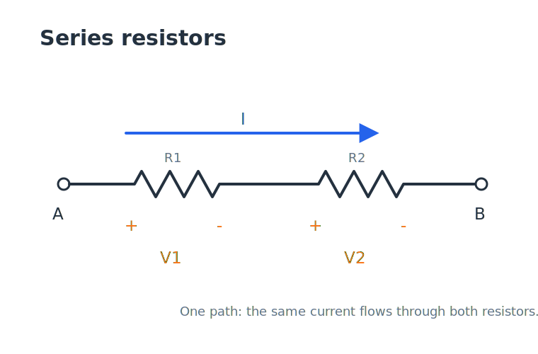

The *voltages*, however, are generally **not** the same. By Ohm's law, the drop across each resistor depends on its own resistance:

$$V_1 = I \cdot R_1 \qquad V_2 = I \cdot R_2$$

If $R_1 \neq R_2$, then $V_1 \neq V_2$. In series, the current is common and the voltage divides up among the components.

### Parallel: shared voltage

Now connect the same two resistors side by side, both spanning the same two points $A$ and $B$:

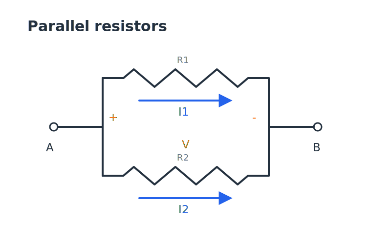

Here the situation is mirrored. Both resistors are connected to the identical pair of nodes, so the **same voltage** appears across each — that is the defining property of a parallel connection. The *currents* now generally differ, since each branch carries $I = V/R$ for its own resistance. In parallel, the voltage is common and the current divides up among the branches.

A compact way to remember the contrast:

| Connection | Shared quantity | Quantity that divides |
|------------|-----------------|-----------------------|
| Series     | current $I$     | voltage               |
| Parallel   | voltage $V$     | current               |

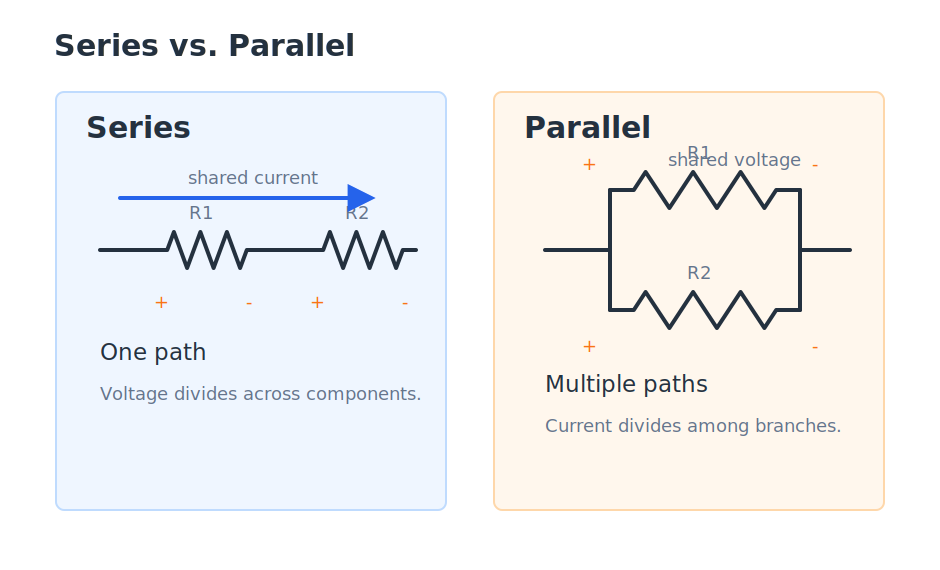

---

## From Resistors to Switches: Continuity

Series and parallel become far more interesting when we replace the resistors with **switches**. A switch is either *closed* (a solid wire, current can pass) or *open* (a break, no current can pass). With switches in the circuit, the question is no longer "how much current?" but a simple yes/no question: **is there continuity** between two points — an unbroken conductive path connecting node $A$ to node $B$?

This yes/no view is exactly the world of digital logic, where everything is a 1 or a 0. Watch what the two topologies do to continuity.

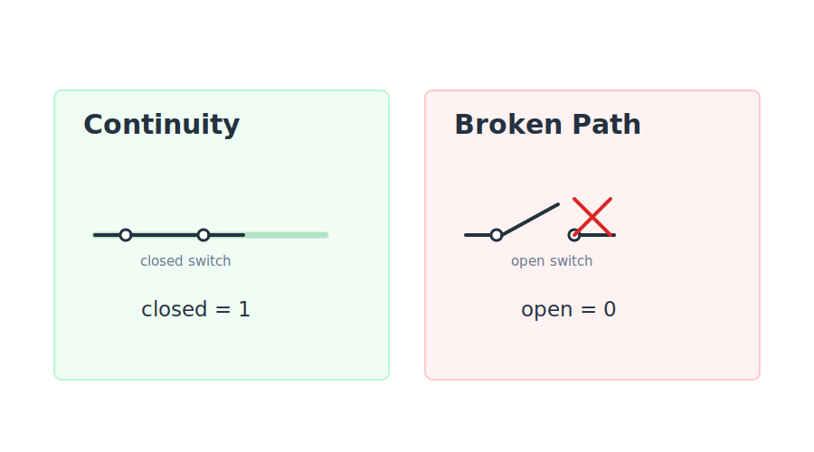

### Series switches behave like AND

Put two switches, $SW_1$ and $SW_2$, in series between $A$ and $B$:

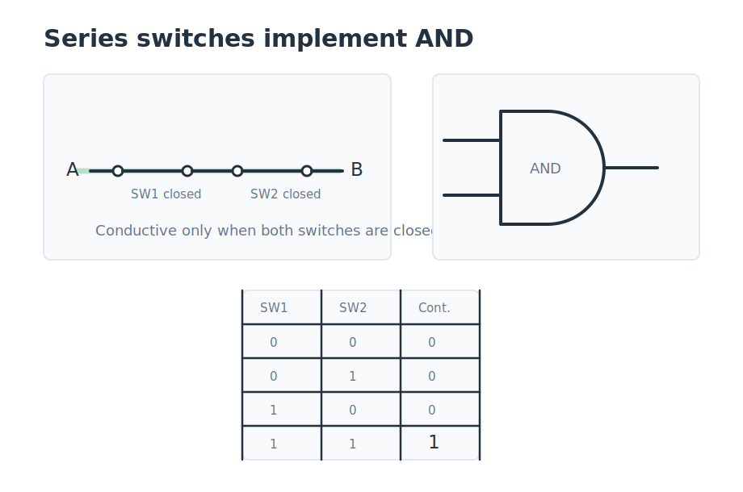

Because they are in series, current would have to pass through *both* to get from $A$ to $B$. If either one is open, the path is broken. You get continuity **if and only if** $SW_1$ is closed **AND** $SW_2$ is closed:

| $SW_1$ | $SW_2$ | Continuity $A\!-\!B$ |
|:------:|:------:|:--------------------:|
| open   | open   | no                   |
| open   | closed | no                   |
| closed | open   | no                   |
| closed | closed | **yes**              |

This is precisely the truth table of the logical **AND** operation, with "closed" playing the role of 1 and "continuity" playing the role of a true output. **Series means AND.**

### Parallel switches behave like OR

Now put the two switches in parallel, each offering its own path from $A$ to $B$:

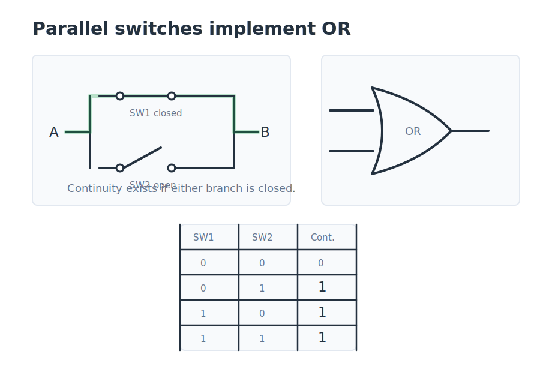

Here current can take either branch. As long as *at least one* switch is closed, a path exists. You get continuity when $SW_1$ is closed **OR** $SW_2$ is closed:

| $SW_1$ | $SW_2$ | Continuity $A\!-\!B$ |
|:------:|:------:|:--------------------:|
| open   | open   | no                   |
| open   | closed | **yes**              |
| closed | open   | **yes**              |
| closed | closed | **yes**              |

That is the truth table of the logical **OR** operation. **Parallel means OR.**

---

## Why This Matters: The Bridge to Logic Gates

We started with three resistors and a battery, and we have arrived at AND and OR. That is not a coincidence — it is the central reason a digital-logic course bothers with circuit theory at all.

A **transistor** can act as a voltage-controlled switch: a signal on its control terminal closes or opens the path between its other two terminals. Once you can build a switch out of a transistor, the series-means-AND and parallel-means-OR rules tell you how to wire transistors together to compute any logic function. Stringing transistors in series gives you an AND-like condition; placing them in parallel gives you an OR-like condition. Combining these patterns is exactly how the logic gates at the heart of every digital chip — and, eventually, every computer — are built. The humble single-loop LED circuit and the two ways of connecting components turn out to be the foundation of the whole subject.

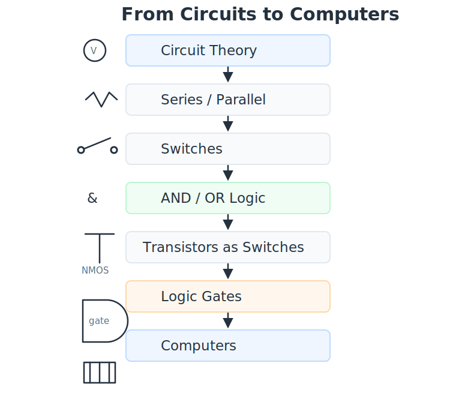

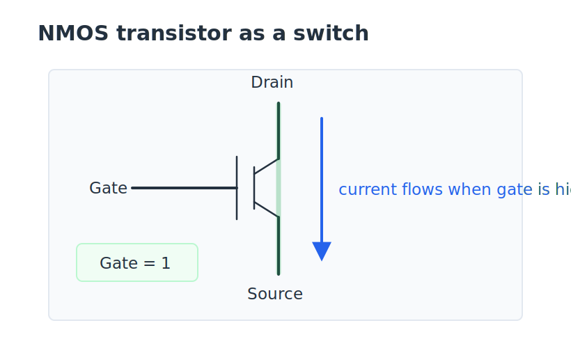

---

## Key Takeaways

A single-loop circuit consists of a voltage source, a current-limiting resistor, and a load, with the **same current flowing through every element**. Ohm's law ($V = I \cdot R$) together with Kirchhoff's voltage law lets us solve for that current as $I = V/R$. Because the source holds the voltage constant, the resistance is the controlling variable: increasing $R$ decreases the current (a dimmer LED), and decreasing $R$ increases it (a brighter LED). The resistor is essential because $R = 0$ would imply runaway current that destroys the load. Connecting components in **series** forces a shared current while the voltage divides; connecting them in **parallel** forces a shared voltage while the current divides. Reinterpreted with switches, a series path has continuity only when *both* switches are closed — the logical **AND** — while a parallel path has continuity when *either* switch is closed — the logical **OR**. Because a transistor is a controllable switch, these two topologies are exactly how transistors are arranged to build logic gates, making basic circuit theory the bridge to all of digital logic.

---

## Review Questions

**1.** In the single-loop circuit, the voltage source is held constant at $5$ V and the series resistance $R$ is increased. What happens to the current $I$ and the brightness of the LED?

- A. $I$ increases and the LED gets brighter
- B. $I$ decreases and the LED gets dimmer
- C. $I$ stays the same because the source is constant
- D. $I$ increases and the LED gets dimmer

**2.** Why does a single-loop LED circuit include a current-limiting resistor?

- A. To increase the supply voltage to a safe level
- B. To store charge while the LED is off
- C. To limit the current so the LED is not destroyed
- D. To convert the LED's voltage drop into light

**3.** Two resistors are connected in **series**. Which quantity is necessarily the same for both?

- A. The voltage across each resistor
- B. The current through each resistor
- C. The power dissipated by each resistor
- D. The resistance of each resistor

**4.** Two switches are wired in **parallel** between nodes $A$ and $B$. There is continuity (an unbroken path) from $A$ to $B$ when:

- A. Both switches are closed
- B. Both switches are open
- C. At least one switch is closed
- D. Exactly one switch is closed

**5.** A designer wires two transistor-switches in **series**. Which logic operation does this arrangement implement, and why?

- A. OR, because either switch alone completes the path
- B. AND, because both switches must be closed to complete the path
- C. NOT, because the second switch inverts the first
- D. OR, because the current divides between the two switches

---

## Answer Explanations

**1. B.** Since $I = V/R$ with $V$ fixed, increasing $R$ makes the current smaller. Less current through the LED means it glows more dimly. (Choice D pairs the right brightness with the wrong current direction; A reverses both; C wrongly assumes a constant source means a constant current.)

**2. C.** With no resistor ($R = 0$), Ohm's law predicts $I = V/0$ — effectively unlimited current, which would destroy the LED. The resistor caps the current at a safe value. It does not raise the supply voltage (A) or store charge (B), and it is the LED, not the resistor, that emits light (D).

**3. B.** In a series connection, the same current must flow through every component because there is only one path. The voltage generally differs between resistors ($V_1 = IR_1$, $V_2 = IR_2$), so A is wrong; power and resistance need not match either (C, D).

**4. C.** Parallel switches each provide an independent path from $A$ to $B$, so the path is complete whenever *at least one* switch is closed — the logical OR. Requiring both (A) describes the series/AND case; "exactly one" (D) is the exclusive-or, not plain OR.

**5. B.** Series switches share a single path, so current reaches the far node only if *both* are closed — the defining behavior of AND. OR corresponds to the parallel arrangement (A, D), and a single switch in series does not invert anything (C).
