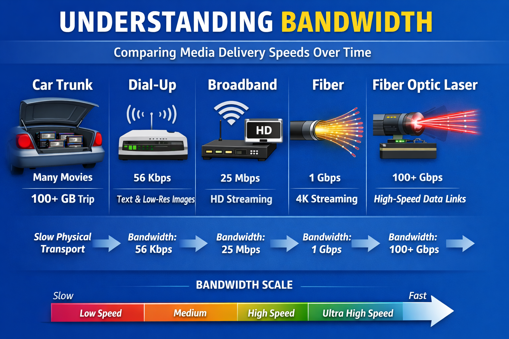

## From Blockbuster to Netflix: Why Digital Wins (Eventually)

You have probably heard the short version of this story: Blockbuster rented movies from stores, Netflix invented streaming, and Blockbuster went out of business. It is a good story — but the short version skips the most interesting part. Streaming did not arrive suddenly, and Blockbuster was not defeated by a single clever idea. The real story took about twenty years, and it is worth telling in a digital logic course because it shows *how* digital technology takes over an industry: not all at once, but piece by piece, as each part of the world becomes ready for it.

Keep one question in mind as you read: **at each stage, what part of the system went digital — and what part couldn't yet?**

## The Blockbuster Era

Many of you wouldn't remember the video store days and would laugh at the idea of Blockbuster now, but in the 1990s it was a well-designed system. A movie contains a lot of information, and back then the internet in most homes was slow — far too slow to deliver a movie. The fastest way to move that much information was to put it on a tape, put the tape on a shelf near your house, and let you drive over and pick it up.

That is worth saying plainly: **for most of the 1990s, your car was faster than the internet** — at least for moving movies. Blockbuster built its whole business around that fact, with thousands of stores so that popular movies were always stored close to the customers who wanted them. Remember that trick of keeping popular things close by; it comes back at the end of the story.

## From VHS to DVD: Analog to Digital

The first crack in Blockbuster's world had nothing to do with the internet. It was the switch from VHS tapes to DVDs — which is really the switch from **analog** to **digital**.

A VHS tape stores a movie as a continuous physical recording, a bit like a groove on a vinyl record. The recording *is* the picture. That means every imperfection in the tape shows up on your screen: as a tape wears out, the picture slowly gets fuzzier and shakier. And if you copy a tape, the copy is a little worse than the original — a copy of a copy of a copy becomes unwatchable.

A DVD stores the movie as **numbers** — millions of 0s and 1s. The player's job is not to reproduce a recording; it is to *read the numbers* and rebuild the picture from them. This changes everything, because small physical imperfections no longer matter. A tiny flaw on the disc still reads as the same 0s and 1s, so you get the *same picture every time*, and a copy is *exactly* as good as the original. This idea — that a signal can be a little bit off and the system still recovers the information perfectly — is one of the central ideas of this entire course.

There is a catch, and it is an interesting one. An analog tape fails *gradually*: more wear, more fuzz, but you can always sort of watch it. A digital disc fails *suddenly*: it is flawless right up until a scratch is too big to read past, and then it skips, freezes, or dies. Perfect, perfect, perfect — then broken. You have experienced this "digital cliff" yourself anytime a bad connection turned a video call from crystal clear into a frozen face.

## A Digital Format Inside a Physical System

Here is the part the short version of the story misses. DVDs were clearly better than tapes — sharper, more durable, perfectly copyable. And yet nothing about the *rental system* changed. You still drove to the store. Blockbuster happily swapped its tapes for discs and kept going.

Why? Because the *movie* had gone digital, but the *delivery* hadn't. Home internet still could not carry a movie. A better format inside the same old system just makes the same old system a little nicer.

There is a lesson here that applies to almost every technology: **an invention spreads fastest when it improves your life without asking you to change your habits.** DVDs asked almost nothing of you — buy a player, keep renting like before. Full digital delivery would ask the whole world to change first.

## Netflix by Mail

Netflix's original business — the one that actually beat Blockbuster — did not stream anything. Netflix noticed that even a slow internet connection was good for one thing: *information*. It could not carry a movie, but it could easily carry a movie *catalog*.

So Netflix split the problem in two. Choosing a movie went digital: you browsed a huge catalog on a website, kept a list of what you wanted, got recommendations — no shelves, no "sorry, it's checked out," no late fees. Delivering the movie stayed physical: the disc came in a red envelope through the mail. Netflix did not even build a delivery network; the postal service already existed and already visited your house every day.

Notice how clever this is. Netflix digitized the part of the experience that the technology of the day *could* support, and borrowed existing infrastructure for the part it couldn't. Half-digital systems like this often look like awkward compromises in hindsight — but they are usually the step that actually changes people's habits.

## What Streaming Required

"Press play and watch instantly" sounds simple. It is actually one of the most demanding things consumers have ever asked of technology, and it only became possible after several separate things happened — none of them controlled by Netflix:

- **Movies got smaller.** Clever software (compression) learned to shrink video dramatically by throwing away detail your eye doesn't notice.
- **Internet connections got faster.** Broadband had to reach *most* homes, not just a few — a technology that only works for some people can't become the normal way of doing things.
- **The movies moved closer to you.** Streaming services keep copies of popular shows on computers near your city, so the data has a short trip. Sound familiar? It is Blockbuster's old trick — keep popular titles close to the customers — rebuilt in digital form.

That last point is worth pausing on. Streaming did not really *destroy* Blockbuster's system. It *digitized* it, piece by piece: the shelf of tapes became storage on a server, the local store became a nearby data center, and the drive home became a fiber-optic cable.

## Digital Systems Fail Differently

Streaming did not make problems disappear; it traded old ones for new ones. Nobody rewinds tapes or pays late fees anymore — instead we get buffering, videos that drop to a blurry resolution mid-scene, and movies that vanish from a service because a license expired. A scratched disc was a problem you could see and understand. Buffering is a problem hiding somewhere in a system that spans half the planet.

That trade is typical of digital systems, and it is good to go in with clear eyes: **digital doesn't eliminate failure — it changes what failure looks like.**

## The Big Picture

The point of this story is not movies. It is a pattern you will see again and again in your career:

1. **Digital information is more robust than analog** — it copies perfectly and tolerates imperfection, up to a cliff.
2. **Being better isn't enough.** A digital technology takes over only when the *whole system* around it — networks, devices, habits, business models — is ready.
3. **The old system's good ideas survive.** They come back in digital form, like Blockbuster's keep-it-close-to-the-customer trick living on inside every streaming service.

The rest of this book is about the first item: how 0s and 1s are represented, moved, and combined so reliably that everything else becomes possible. As you learn those details, keep this story in mind — every threshold and every gate you study is part of the machinery that ate an entire industry.

## Key Takeaways

Analog systems store information as a continuous physical signal, so they degrade gradually and copies get worse. Digital systems store information as 0s and 1s, so small imperfections are ignored, copies are perfect, and quality is constant — until damage crosses a threshold and the system fails suddenly (the digital cliff). But a better representation alone changes little: DVDs went digital while rental stayed physical, Netflix digitized choosing before delivering, and streaming became possible only after compression, broadband, and nearby servers all existed. Digital wins when the whole system is ready — and the old system's best ideas return in digital form.

## Review Questions

### Question 1

Why can a DVD be copied perfectly, while a copy of a VHS tape is always a little worse than the original?

A. DVDs are made of more durable material  
B. A DVD stores numbers, and the numbers can be read exactly and rewritten exactly; a tape stores a continuous physical signal whose flaws are copied and compounded  
C. DVD copying machines are more precise than VHS ones  
D. VHS tapes hold more information than DVDs

### Question 2

A movie plays flawlessly from a lightly scratched DVD, but a deeper scratch makes it freeze completely. What does this illustrate?

A. Digital systems degrade gradually, like analog ones  
B. DVDs were poorly designed  
C. Digital systems tolerate imperfection up to a threshold, then fail suddenly — the digital cliff  
D. Scratches convert digital information into analog information

### Question 3

Early Netflix beat Blockbuster *without* streaming. What was its key move?

A. Building its own delivery trucks  
B. Digitizing the choosing of movies (an online catalog) while using the existing postal system for physical delivery  
C. Inventing better compression than its competitors  
D. Opening more stores than Blockbuster

### Question 4

Streaming services keep copies of popular shows on servers near each city. Which older idea is this a digital version of?

A. Blockbuster keeping popular movies on shelves in local stores, close to customers  
B. VHS tapes storing video as a magnetic signal  
C. Mailing DVDs in envelopes  
D. Paying late fees to encourage returns

## Answer Explanations

**1. B.** Digital information is numbers. As long as the numbers are read correctly — and small physical flaws don't prevent that — a copy contains exactly the same 0s and 1s as the original. An analog recording *is* the physical signal, so every copy inherits its flaws and adds new ones.

**2. C.** Digital systems ignore imperfections below a threshold, which is why the light scratch is invisible. Past the threshold, the information can no longer be recovered and the failure is abrupt rather than gradual.

**3. B.** Netflix digitized what the era's internet could handle — information about movies — and borrowed already-built infrastructure (the mail) for what it couldn't. Changing the choosing changed customers' habits; delivery stayed physical until the world caught up.

**4. A.** Both are the same system idea: keep popular content stored close to the people who want it, so it arrives quickly. Streaming rebuilt Blockbuster's local-store trick out of servers and cables.
