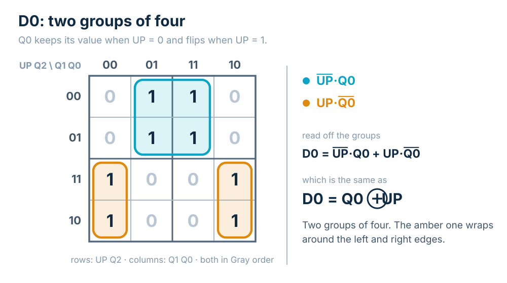
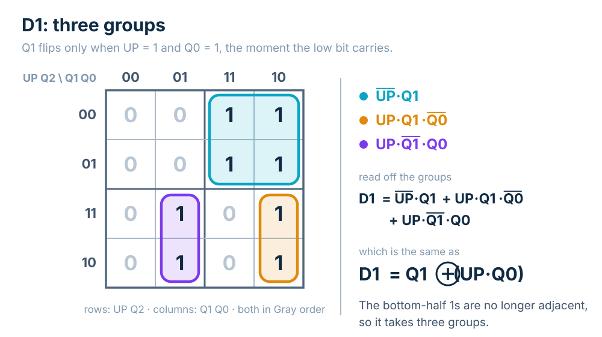
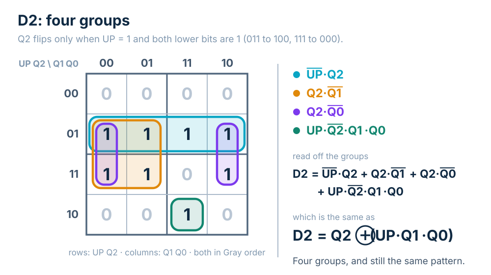

A **counter** is a state machine whose job is to step through the binary numbers in order. Counters are everywhere in digital systems: they divide a fast clock down to a slow one, count events such as coins or button presses, step through the addresses of a memory, and time how long a state machine should wait before moving on. You will build several of them in the lab.

Counters are also good practice for the finite state machine design flow, for two reasons. First, the state assignment is free: the state *is* the count, so state 5 is simply stored as 101, and there is no encoding to choose. All of the design work goes into the next-state logic. Second, a counter has more states than the small machines seen so far. A 3-bit counter has eight states, so its K-maps have four variables, and its equations turn out to follow a pattern you can extend to any number of bits without drawing another map.

## The Specification

The counter in this topic is a 3-bit counter with a **count-enable** input called UP.

- When $UP = 1$, each clock edge adds one to the count: 000, 001, 010, and so on up to 111, which wraps around to 000.
- When $UP = 0$, the count **holds**: clock edges come and go, and the count does not change.

The count is held in three D flip-flops, $Q_2 Q_1 Q_0$, with $Q_2$ the most significant bit. There are no other outputs: the count itself is what the rest of the system reads.

## The State Diagram

The eight states sit in a ring, 000 through 111, each with one arc to the next count, and the arc out of 111 closes the ring back at 000. Every one of those arcs is labeled UP, because it is only taken when UP is 1.

Each state also has a second arc for $UP = 0$: a self-loop, since holding means the next state is the current state. Drawing eight self-loops would clutter the diagram without telling the reader anything new, so the common convention is to **leave the hold loops out**. Any input condition with no arc drawn for it is understood to keep the machine where it is. In the interactive on this page, setting UP to 0 makes the loop appear on the current state, and clocking then does nothing.

Here is the counter over twelve clock periods, with UP dropped to 0 for two of them. Each column shows the count during that clock period and the value of UP sampled at the edge that ends it.

| Clock | 0 | 1 | 2 | 3 | 4 | 5 | 6 | 7 | 8 | 9 | 10 | 11 |
|:-:|:-:|:-:|:-:|:-:|:-:|:-:|:-:|:-:|:-:|:-:|:-:|:-:|
| $UP$ | 1 | 1 | 1 | 0 | 0 | 1 | 1 | 1 | 1 | 1 | 1 | 1 |
| $Q_2 Q_1 Q_0$ | 000 | 001 | 010 | 011 | 011 | 011 | 100 | 101 | 110 | 111 | 000 | 001 |

The count climbs to 011, holds there while UP is 0, climbs again, and wraps from 111 to 000.

## The Next-State Table

The next-state table lists every combination of the input and the current state, sixteen rows in all, with the next state $Q_2^+ Q_1^+ Q_0^+$ for each. It is unusually easy to fill in. In the eight rows with $UP = 0$, the next state is a copy of the current state. In the eight rows with $UP = 1$, it is the current state plus one, with 111 wrapping to 000.

| $UP$ | $Q_2$ | $Q_1$ | $Q_0$ | $Q_2^+$ | $Q_1^+$ | $Q_0^+$ |
|:-:|:-:|:-:|:-:|:-:|:-:|:-:|
| 0 | 0 | 0 | 0 | 0 | 0 | 0 |
| 0 | 0 | 0 | 1 | 0 | 0 | 1 |
| 0 | 0 | 1 | 0 | 0 | 1 | 0 |
| 0 | 0 | 1 | 1 | 0 | 1 | 1 |
| 0 | 1 | 0 | 0 | 1 | 0 | 0 |
| 0 | 1 | 0 | 1 | 1 | 0 | 1 |
| 0 | 1 | 1 | 0 | 1 | 1 | 0 |
| 0 | 1 | 1 | 1 | 1 | 1 | 1 |
| 1 | 0 | 0 | 0 | 0 | 0 | 1 |
| 1 | 0 | 0 | 1 | 0 | 1 | 0 |
| 1 | 0 | 1 | 0 | 0 | 1 | 1 |
| 1 | 0 | 1 | 1 | 1 | 0 | 0 |
| 1 | 1 | 0 | 0 | 1 | 0 | 1 |
| 1 | 1 | 0 | 1 | 1 | 1 | 0 |
| 1 | 1 | 1 | 0 | 1 | 1 | 1 |
| 1 | 1 | 1 | 1 | 0 | 0 | 0 |

With D flip-flops, the value a flip-flop should hold next is exactly what goes on its D input, so each next-state column is the truth table for one D input. Numbering the rows by $UP\,Q_2 Q_1 Q_0$ as a 4-bit number, each column becomes a minterm list:

$$D_2 = \Sigma m(4, 5, 6, 7, 11, 12, 13, 14)$$
$$D_1 = \Sigma m(2, 3, 6, 7, 9, 10, 13, 14)$$
$$D_0 = \Sigma m(1, 3, 5, 7, 8, 10, 12, 14)$$

Every state is used, so unlike the Level-to-Pulse FSM there are no don't-cares.

## The K-Maps

Each minterm list goes onto a four-variable K-map with $UP\,Q_2$ on the rows and $Q_1 Q_0$ on the columns, both in Gray order. The top two rows are the hold half of the table ($UP = 0$) and the bottom two rows are the counting half ($UP = 1$). From there each map is an ordinary minimization problem, and the maps get harder as the bits go up.



$D_0$ takes two groups of four. In the hold half, the 1s are wherever $Q_0 = 1$. In the counting half, they are wherever $Q_0 = 0$, and that group wraps around the left and right edges of the map, which are adjacent.

$$D_0 = \overline{UP}\,Q_0 + UP\,\overline{Q_0}$$



$D_1$ takes three groups. The hold half is one block of four, but in the counting half the two pairs of 1s are no longer adjacent, so each needs its own group.

$$D_1 = \overline{UP}\,Q_1 + UP\,Q_1\overline{Q_0} + UP\,\overline{Q_1}Q_0$$



$D_2$ takes four groups, including a single cell that cannot join anything.

$$D_2 = \overline{UP}\,Q_2 + Q_2\overline{Q_1} + Q_2\overline{Q_0} + UP\,\overline{Q_2}Q_1 Q_0$$

## A Pattern in the Equations

The sum-of-products forms grow from two terms to three to four, but each one can be rewritten as a much simpler exclusive-OR:

$$D_0 = Q_0 \oplus UP$$
$$D_1 = Q_1 \oplus (UP \cdot Q_0)$$
$$D_2 = Q_2 \oplus (UP \cdot Q_1 \cdot Q_0)$$

The $D_0$ case is easy to see: $\overline{UP}\,Q_0 + UP\,\overline{Q_0}$ is the definition of $Q_0 \oplus UP$. For the others, split on the value of UP. Take $D_1$:

- When $UP = 0$, the SOP form reduces to $Q_1$, and so does $Q_1 \oplus (0 \cdot Q_0) = Q_1 \oplus 0 = Q_1$.
- When $UP = 1$, the SOP form reduces to $Q_1\overline{Q_0} + \overline{Q_1}Q_0 = Q_1 \oplus Q_0$, and so does $Q_1 \oplus (1 \cdot Q_0)$.

The two forms agree for both values of UP, so they are equal. The same split proves the $D_2$ form, and all three have been checked against every row of the table.

The XOR form says something the SOP form hides. XOR with 0 leaves a bit alone and XOR with 1 flips it, so each equation reads as "**bit *i* toggles when its enable is 1**." The enables are:

| Bit | Toggles when | What that means |
|:-:|:-:|:-|
| $Q_0$ | $UP$ | every count |
| $Q_1$ | $UP \cdot Q_0$ | counting, and the bit below it is 1 |
| $Q_2$ | $UP \cdot Q_1 \cdot Q_0$ | counting, and both bits below it are 1 |

This is just how binary addition works. Adding 1 flips the lowest bit, and a carry ripples into a higher bit only when every bit below it is 1, as in 011 + 1 = 100 and 111 + 1 = 000. Each enable is the one before it with one more factor.

## Guessing the 4-Bit Counter

That pattern makes the next bit a guess rather than a K-map. A 4-bit counter needs a fourth flip-flop, and $Q_3$ should toggle when the machine is counting and all three bits below it are 1:

$$D_3 = Q_3 \oplus (UP \cdot Q_2 \cdot Q_1 \cdot Q_0)$$

That is correct. With all four bits, the equations reproduce count-up and hold for all 32 combinations of UP and the count, and $Q_3$ flips exactly twice in a full count, at 0111 → 1000 and at 1111 → 0000. An *n*-bit counter needs no new K-maps, just one more flip-flop, one more XOR, and an enable that is the previous enable ANDed with one more bit. The interactive's last stage lets you make the guess before revealing it.

## The Circuit

The XOR forms translate directly into a circuit with three D flip-flops on a common clock:

- **One XOR gate per bit**, in front of that bit's D input. One XOR input is the bit's own output $Q_i$, fed back; the other is the bit's toggle enable.
- **An AND chain for the enables.** Bit 0's enable is UP itself. Bit 1's is $UP \cdot Q_0$. Bit 2's is $UP \cdot Q_1 \cdot Q_0$, which can also be built as (bit 1's enable) $\cdot\, Q_1$, so each new bit adds one 2-input AND gate, the same carry idea as a ripple-carry adder.

## The Same Counter in Verilog

The equations can be written out line for line, which describes the circuit gate by gate:

```verilog
module counter3_gates (
    input  wire       clk,
    input  wire       reset,
    input  wire       UP,
    output reg  [2:0] Q
);
    wire [2:0] D;
    assign D[0] = Q[0] ^ UP;
    assign D[1] = Q[1] ^ (UP & Q[0]);
    assign D[2] = Q[2] ^ (UP & Q[1] & Q[0]);

    always @(posedge clk)
        if (reset) Q <= 3'b000;
        else       Q <= D;
endmodule
```

Or the counter can be described by what it does, and the synthesis tool works out the gates:

```verilog
module counter3 (
    input  wire       clk,
    input  wire       reset,
    input  wire       UP,
    output reg  [2:0] Q
);
    always @(posedge clk)
        if (reset)   Q <= 3'b000;
        else if (UP) Q <= Q + 3'd1;   // 3 bits wide: 111 + 1 wraps to 000
endmodule
```

In the behavioral version, holding needs no code at all: when UP is 0 nothing is assigned, so the register keeps its value. A testbench driving both modules with the UP sequence from the trace above prints (simulated with Icarus Verilog):

```
clock  0: UP=1  gates Q=000  behavioral Q=000
clock  1: UP=1  gates Q=001  behavioral Q=001
clock  2: UP=1  gates Q=010  behavioral Q=010
clock  3: UP=0  gates Q=011  behavioral Q=011
clock  4: UP=0  gates Q=011  behavioral Q=011
clock  5: UP=1  gates Q=011  behavioral Q=011
clock  6: UP=1  gates Q=100  behavioral Q=100
clock  7: UP=1  gates Q=101  behavioral Q=101
clock  8: UP=1  gates Q=110  behavioral Q=110
clock  9: UP=1  gates Q=111  behavioral Q=111
clock 10: UP=1  gates Q=000  behavioral Q=000
clock 11: UP=1  gates Q=001  behavioral Q=001
```

The two descriptions agree on every clock, including the two-clock hold at 011 and the wrap from 111 to 000.

## Key Takeaways

A counter is a state machine whose state is its count, so there is no state-encoding decision to make. The 3-bit counter with count-enable steps through 000 to 111 and wraps when UP is 1, and holds when UP is 0. State diagrams commonly leave out the hold self-loops, which are understood. The next-state table splits cleanly into a hold half and a counting half, and each next-state column becomes a minterm list and then a four-variable K-map. The maps grow harder bit by bit, from two groups to three to four, yet each result reduces to an XOR: $D_0 = Q_0 \oplus UP$, $D_1 = Q_1 \oplus (UP \cdot Q_0)$, $D_2 = Q_2 \oplus (UP \cdot Q_1 Q_0)$. Each bit toggles when UP is 1 and every lower bit is 1, which is exactly when adding one carries into it. That pattern extends to any width, so a 4-bit counter needs only $D_3 = Q_3 \oplus (UP \cdot Q_2 Q_1 Q_0)$, and the circuit is one flip-flop, one XOR and one AND per bit.

## Review Questions

**1. Why does a counter need no separate state-assignment step?**

A. Counters always use one-hot encoding\
B. The state is the count, so each state is stored as its own binary value\
C. Counters have no output, so the encoding does not matter\
D. Every state assignment gives the same K-maps

**2. The counter holds 101 and UP = 0. What does it hold after the next clock edge?**

A. 101\
B. 110\
C. 100\
D. 000

**3. The state diagram shows only the UP = 1 arcs. What happens when UP = 0?**

A. The machine returns to 000\
B. The behavior is undefined\
C. The machine stays in its current state\
D. The machine counts down

**4. Which equation gives the next value of $Q_1$?**

A. $D_1 = Q_1 \oplus UP$\
B. $D_1 = UP \cdot Q_1 \cdot Q_0$\
C. $D_1 = Q_1 \oplus Q_0$\
D. $D_1 = Q_1 \oplus (UP \cdot Q_0)$

**5. Following the pattern, when does bit $Q_3$ of a 4-bit counter toggle?**

A. On every clock edge\
B. When UP is 1 and $Q_2 Q_1 Q_0 = 111$\
C. When UP is 1 and $Q_2 = 1$\
D. When UP is 1 and $Q_2 Q_1 Q_0 = 000$

## Answer Explanations

**1. B.** Usual counter practice stores each state as the binary number it stands for, so state 5 is 101. The encoding is decided by the counting itself, and the design work goes entirely into the next-state logic. One-hot (A) is a different, deliberate choice, and different assignments do give different K-maps (D), which is the point of the Binary State Assignment topic.

**2. A.** With UP = 0 the counter holds, so the next state equals the current state. In the table, every row in the UP = 0 half copies the current state into the next state. Answer B is what counting up would give.

**3. C.** The hold self-loops are left off the diagram to avoid clutter, and a condition with no arc drawn is understood to keep the machine where it is. Nothing in this counter counts down (D); UP only enables counting.

**4. D.** $Q_1$ flips only when the counter is counting and the bit below it is 1. Answer C is right when UP = 1 but would keep toggling $Q_1$ while the counter is supposed to be holding, and answer A ignores $Q_0$ entirely.

**5. B.** Each bit toggles when UP is 1 and every lower bit is 1, so $D_3 = Q_3 \oplus (UP \cdot Q_2 Q_1 Q_0)$. That happens at 0111 → 1000 and 1111 → 0000, which is exactly when adding one carries into bit 3. Answer C would toggle $Q_3$ far too often.
