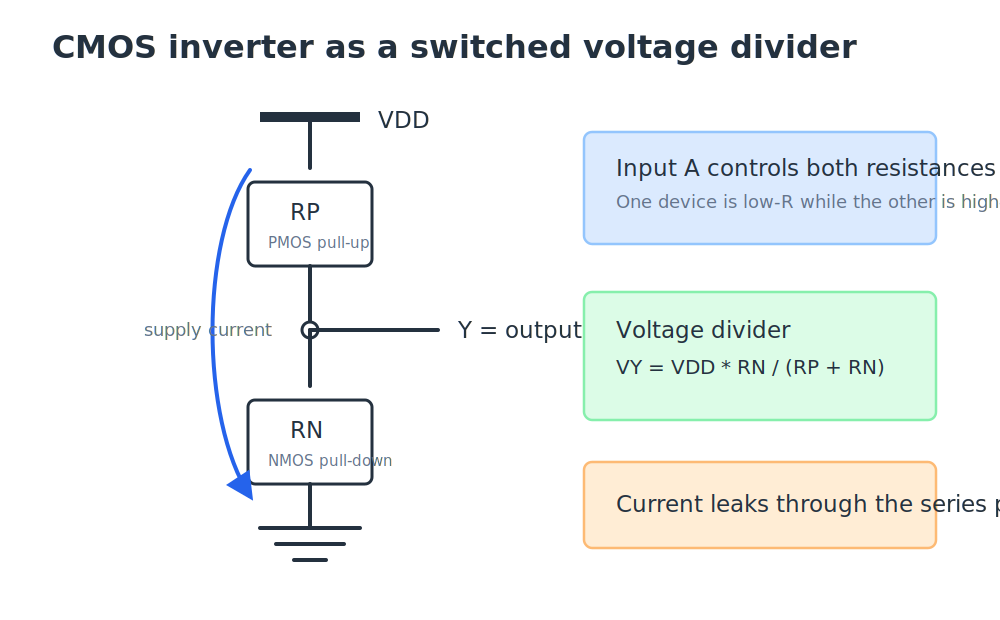
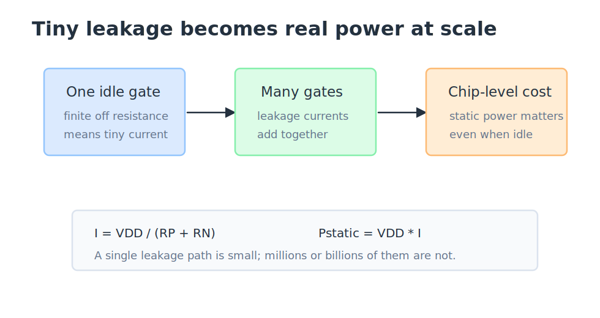
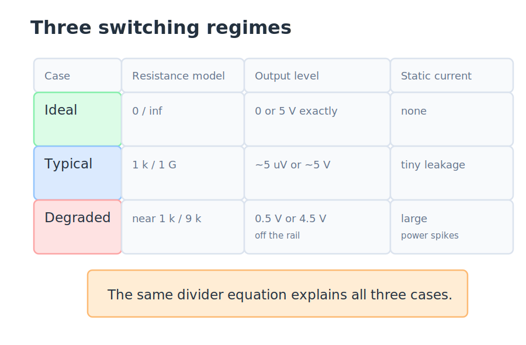
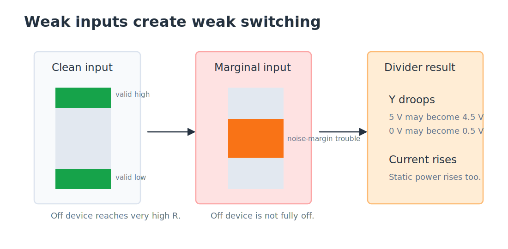

# Non-Ideal Switching

The ideal CMOS inverter model treats transistors as perfect switches. When a transistor is on, it is a wire with $0\ \Omega$ of resistance. When it is off, it is an open circuit with infinite resistance. That model is useful because it makes the logic behavior obvious: a low input turns the PMOS pull-up on and the NMOS pull-down off, so the output goes high; a high input does the opposite, so the output goes low.

Real transistors are not perfect switches. An on transistor still has some resistance, and an off transistor still leaks a small amount of current. To understand that behavior without jumping into full transistor physics, we can replace each transistor with an input-controlled resistor. This gives us a simple model that still explains real effects: nonzero output error, leakage current, static power, and degraded logic levels when an input is not clean.

## From Switches to a Resistor Network

A CMOS inverter has two devices in series between the supply and ground. The PMOS pull-up is on top, the NMOS pull-down is on the bottom, and the output node sits between them. In the resistor model, the PMOS becomes $R_P$ and the NMOS becomes $R_N$. The input $A$ controls both values.

When $A=0$, the PMOS is on and the NMOS is off. That makes $R_P$ small and $R_N$ large, so the output is pulled close to $V_{DD}$. When $A=1$, the PMOS is off and the NMOS is on. That makes $R_P$ large and $R_N$ small, so the output is pulled close to ground.

Because the output node is between two series resistances, the output voltage follows the voltage-divider equation:

$$V_Y = V_{DD}\cdot\frac{R_N}{R_P + R_N}.$$

> **Key idea:** The logic behavior comes from the resistance ratio. The output goes high when $R_N$ is much larger than $R_P$, and it goes low when $R_N$ is much smaller than $R_P$.

## The Ideal Case

In the ideal switch model, the on device has $0\ \Omega$ of resistance and the off device has infinite resistance. Substituting those extremes into the divider gives exact inverter behavior.

| Input $A$ | PMOS $R_P$       | NMOS $R_N$       | Output $Y$       |
|-----------|------------------|------------------|------------------|
| 0         | $0\ \Omega$      | $\infty$         | $V_{DD}$         |
| 1         | $\infty$         | $0\ \Omega$      | $0\ \text{V}$    |

This is the abstraction we want for Boolean logic. The output is exactly at a rail, and no static current flows because the path from $V_{DD}$ to ground is broken by the open device. In this model, an idle CMOS inverter consumes no power.

> **Ideal model:** Perfect switching gives perfect rail voltages and zero static power.

## Finite Resistance in Real Devices

Real devices do not reach those extremes. A transistor that is on may have a resistance around $1\ \text{k}\Omega$. A transistor that is off may have a resistance around $1\ \text{G}\Omega$. Those numbers are far apart, so the inverter still works, but they are not $0$ and $\infty$.

Suppose $V_{DD}=5\ \text{V}$ and the input is high. The NMOS is on, so $R_N\approx 1\ \text{k}\Omega$. The PMOS is off, so $R_P\approx 1\ \text{G}\Omega$. The divider gives:

$$V_Y = 5\ \text{V}\cdot\frac{1\ \text{k}\Omega}{1\ \text{G}\Omega + 1\ \text{k}\Omega}\approx 5\ \mu\text{V}.$$

That is essentially a logic 0, but it is not exactly $0\ \text{V}$. If the input is low, the roles reverse and the output is very close to $5\ \text{V}$, but again not mathematically perfect.

The same resistance values also imply a small current through the stack:

$$I = \frac{V_{DD}}{R_P + R_N}.$$

With one resistance near $1\ \text{G}\Omega$, the current is tiny. But it is not zero, and the power supply must provide it.

## Leakage Current and Static Power

Leakage current is the small current that flows because the off transistor has finite resistance. The corresponding static power is

$$P_\text{static}=V_{DD}\cdot I.$$

For one inverter, this value is usually very small. The problem is scale. A modern chip contains a very large number of transistors, so small leakage currents can add together into meaningful power consumption.

This is why leakage is not just a device-physics detail. It affects battery life, heat, power delivery, and how large systems are designed. Later techniques such as **power gating** reduce leakage by disconnecting idle blocks so they do not continuously leak through their transistor stacks.

> **Key idea:** Ideal CMOS has no static power. Real CMOS has leakage, and leakage matters when it is multiplied across many devices.

## Three Operating Regimes

The same voltage-divider model helps compare three cases: ideal switching, typical real switching, and degraded switching.

| Operating case | Resistance model                         | Output behavior                  | Static current       |
|----------------|-------------------------------------------|----------------------------------|----------------------|
| Ideal          | on $=0\ \Omega$, off $=\infty$            | exactly $0$ or $V_{DD}$          | none                 |
| Typical        | on $\approx 1\ \text{k}\Omega$, off $\approx 1\ \text{G}\Omega$ | very close to the rail           | tiny leakage         |
| Degraded       | off device is not very high resistance    | output moves away from the rail  | much larger current  |

In the typical case, the off resistance is so much larger than the on resistance that the output remains a valid logic level. In the degraded case, the off device is not really off, so the divider no longer has an extreme ratio. The output voltage shifts away from the rail, and the current rises.

## Weak Inputs and Degraded Switching

Digital gates expect inputs to be clearly low or clearly high. The allowed ranges are described by **noise margins**. If an input drifts toward the middle, a transistor that should be off may not turn fully off. Its channel resistance can be much lower than expected.

If the PMOS is on at about $1\ \text{k}\Omega$ but the NMOS that should be off only rises to about $9\ \text{k}\Omega$, then the output is no longer nearly $5\ \text{V}$. The divider gives a high output around $4.5\ \text{V}$. In the opposite state, a weakly off PMOS can let a low output rise to around $0.5\ \text{V}$.

The voltage error is only part of the problem. The total resistance from $V_{DD}$ to ground is now much smaller, so the current rises sharply. Since $P=V_{DD}\cdot I$, the static power rises too.

> **Design habit:** Keep digital inputs inside their valid noise-margin ranges. Weak inputs hurt both correctness and power.

## Why the Model Is Useful

The switched-resistor model is still a simplification. A real MOS transistor is not literally a resistor with two possible values, and transistor behavior depends on voltage, geometry, process, and temperature. But the model is useful because it adds just enough realism to answer questions the ideal-switch model cannot answer.

It explains why a logic 0 may be microvolts instead of exactly zero, why an idle circuit can still draw current, why leakage power grows with transistor count, and why marginal input voltages create both output droop and higher static power. It also gives a single equation, $V_Y = V_{DD}R_N/(R_P+R_N)$, that connects all of those ideas.

## Key Takeaways

A CMOS inverter can be modeled as a switched voltage divider with $R_P$ on top and $R_N$ on the bottom. In the ideal case, the resistances are $0$ and $\infty$, so the output reaches the rails exactly and no static current flows. In real devices, on resistance is small but nonzero and off resistance is large but finite, so the output is only approximately at the rail and a small leakage current flows. Across many transistors, leakage becomes static power. If an input is weak or outside the noise margin, the off device may not fully turn off, causing output droop and a sharp increase in current and power.

## Review Questions

1. In the switched-resistor model of a CMOS inverter, what does the input $A$ control?
   A. The supply voltage $V_{DD}$
   B. The resistance values $R_P$ and $R_N$
   C. The physical location of the output node
   D. Whether the circuit has a ground connection

2. Why does the output of a real inverter not reach exactly $0\ \text{V}$ in the typical high-input case?
   A. The NMOS is disconnected from ground
   B. The PMOS off resistance is finite, so a small divider voltage remains
   C. The input voltage is always analog
   D. The output node is not part of the voltage divider

3. With $V_{DD}=5\ \text{V}$, $R_N=1\ \text{k}\Omega$, and $R_P=1\ \text{G}\Omega$, the output is closest to:
   A. $0\ \text{V}$ exactly
   B. $5\ \mu\text{V}$
   C. $2.5\ \text{V}$
   D. $5\ \text{V}$

4. What causes static leakage power in this model?
   A. The off transistor has finite resistance, so a small current path remains
   B. The inverter output is switching quickly
   C. The truth table has an invalid row
   D. The supply voltage is zero

5. What happens when an input is marginal and the off transistor does not fully turn off?
   A. The output stays exactly at the rail and current remains zero
   B. The output moves away from the rail and current increases
   C. The inverter stops being a voltage divider
   D. The supply voltage automatically decreases

6. Why is the switched-resistor model useful even though it is not a complete transistor model?
   A. It removes the need to understand logic levels
   B. It explains leakage, static power, and degraded outputs using a simple divider
   C. It proves real transistors have infinite off resistance
   D. It only works for ideal switches

## Answer Explanations

1. **B.** The input controls which transistor has low resistance and which has high resistance. That resistance ratio determines whether the output is pulled high or low.

2. **B.** A finite off resistance means the path is not perfectly open. The divider leaves a tiny voltage at the output, even though it is still read as a logic 0.

3. **B.** The divider is $5\cdot 1\text{k}/(1\text{G}+1\text{k})$, which is about $5\ \mu\text{V}$.

4. **A.** Static leakage comes from the small current that flows through the finite off resistance even when the gate is not switching.

5. **B.** A weakly off device lowers the total resistance and damages the divider ratio, so the output droops away from the rail while current and power rise.

6. **B.** The model is simple but captures important real effects that the perfect-switch model hides: finite output error, leakage current, static power, and weak switching.
