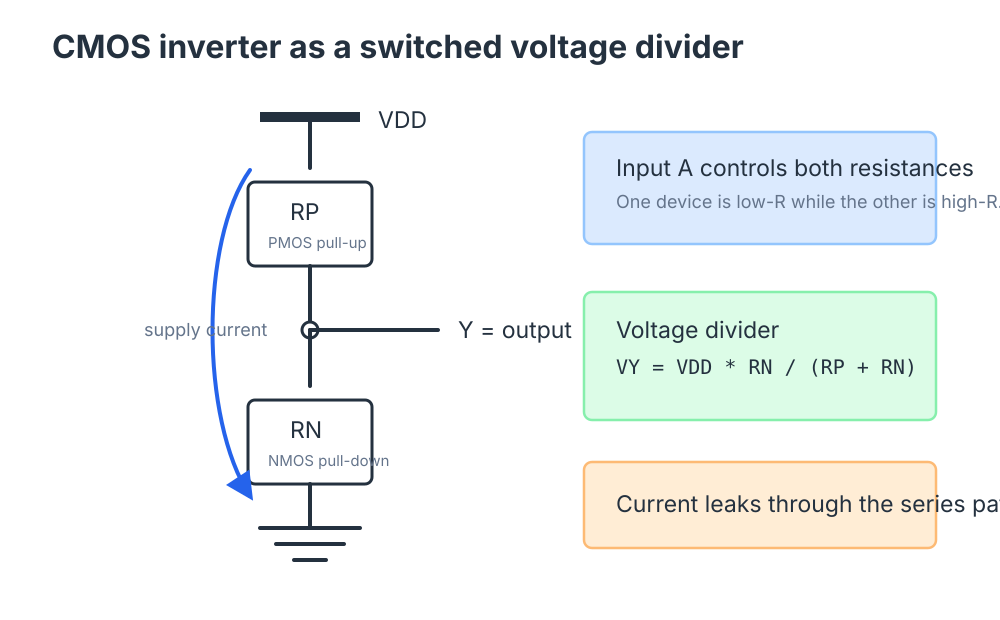
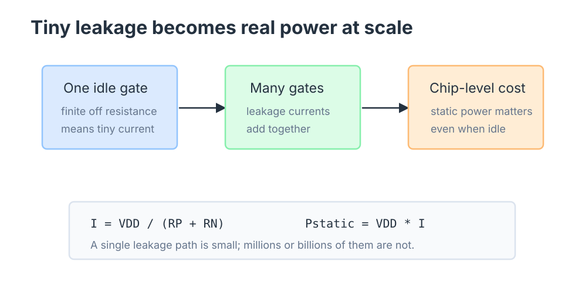
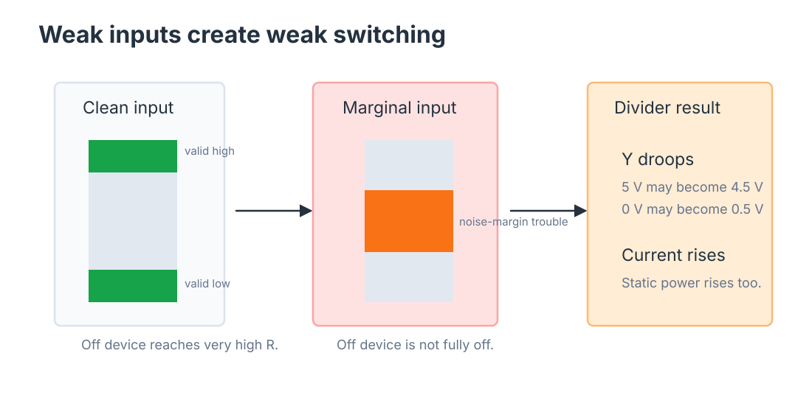
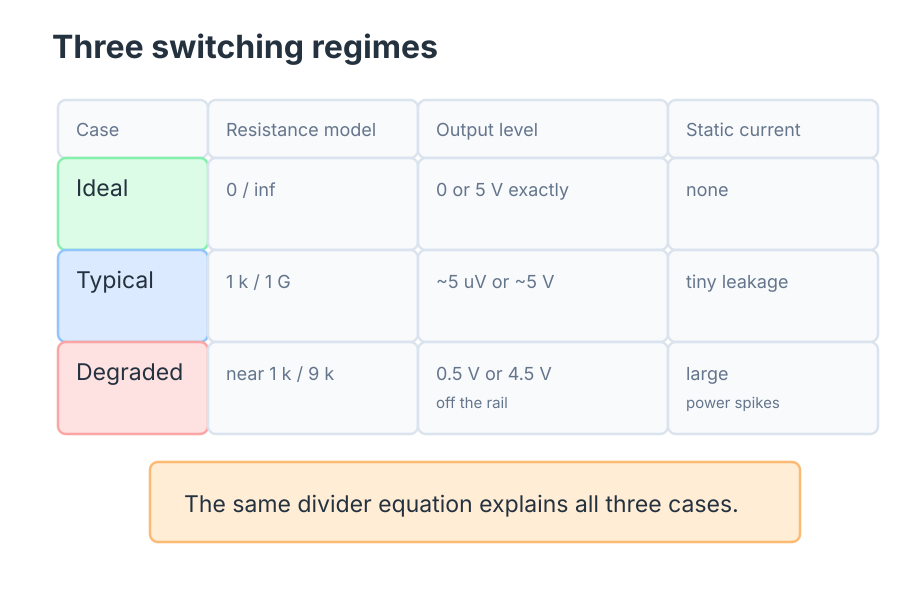

## Non-Ideal Switching

The ideal CMOS inverter model treats transistors as perfect switches. When a transistor is on, it is a wire with $0\ \Omega$ of resistance. When it is off, it is an open circuit with infinite resistance. That model is useful because it makes the logic behavior obvious: a low input turns the PMOS pull-up on and the NMOS pull-down off, so the output goes high; a high input does the opposite, so the output goes low.

Real transistors are not perfect switches. An on transistor still has some resistance, and an off transistor still leaks a small amount of current. This is a normal move in engineering: keep the simple model, then layer in one more parameter when the simple model stops answering the questions you have. To understand real switching without jumping into transistor physics, we replace each transistor with an input-controlled resistor. The result is still a simplification, but it explains effects the perfect-switch model cannot: an output that is not *exactly* at the rail, leakage current, static power, and degraded logic levels when an input is not clean.

The interactive above is this model made live. It lets you choose the operating case — ideal, typical, or degraded — flip the input, and watch the output voltage, the supply current, and the static power respond. Keep it open as you read; the numbers below are the numbers it computes.

## From Switches to a Resistor Network

A CMOS inverter has two devices in series between the supply and ground. The PMOS pull-up is on top, the NMOS pull-down is on the bottom, and the output node sits between them. In the resistor model, the PMOS becomes $R_P$ and the NMOS becomes $R_N$. The input $A$ controls both values.

When $A=0$, the PMOS is on and the NMOS is off. That makes $R_P$ small and $R_N$ large, so the output is pulled close to $V_{DD}$. When $A=1$, the PMOS is off and the NMOS is on. That makes $R_P$ large and $R_N$ small, so the output is pulled close to ground.

Because the output node is between two series resistances, the output voltage follows the voltage-divider equation from the first weeks of any circuits course:

$$V_Y = V_{DD}\cdot\frac{R_N}{R_P + R_N}.$$

And because the two resistances form one series path from supply to ground, one current flows through both of them:

$$I = \frac{V_{DD}}{R_P + R_N}, \qquad P_\text{static} = V_{DD}\cdot I.$$

These two equations are the whole model. Everything in this topic comes from putting different resistance values into them.

> **Key idea:** The logic behavior comes from the resistance *ratio*. The output goes high when $R_N$ is much larger than $R_P$, and it goes low when $R_N$ is much smaller than $R_P$. The current and power come from the resistance *sum*.

## The Ideal Case

In the ideal switch model, the on device has $0\ \Omega$ of resistance and the off device has infinite resistance. Substituting those extremes into the divider gives exact inverter behavior.

| Input $A$ | PMOS $R_P$       | NMOS $R_N$       | Output $Y$       |
|-----------|------------------|------------------|------------------|
| 0         | $0\ \Omega$      | $\infty$         | $V_{DD}$         |
| 1         | $\infty$         | $0\ \Omega$      | $0\ \text{V}$    |

This is the abstraction we want for Boolean logic. The output is exactly at a rail, and no static current flows because the path from $V_{DD}$ to ground is broken by the open device — an infinite resistance in the sum makes $I$ exactly zero. In this model, an idle CMOS inverter consumes no power at all.

> **Ideal model:** Perfect switching gives perfect rail voltages and zero static power.

## Finite Resistance in Real Devices

Real devices do not reach those extremes. A transistor that is on may have a resistance around $1\ \text{k}\Omega$. A transistor that is off may have a resistance around $1\ \text{G}\Omega$. A kilohm is a real, significant resistance on its own — but next to a gigohm it is negligible, a ratio of a million to one. Those numbers are far apart, so the inverter still works, but they are not $0$ and $\infty$.

Suppose $V_{DD}=5\ \text{V}$ and the input is high. The NMOS is on, so $R_N\approx 1\ \text{k}\Omega$. The PMOS is off, so $R_P\approx 1\ \text{G}\Omega$. The divider gives:

$$V_Y = 5\ \text{V}\cdot\frac{1\ \text{k}\Omega}{1\ \text{G}\Omega + 1\ \text{k}\Omega}\approx 5\ \mu\text{V}.$$

That is essentially a logic 0, but it is not exactly $0\ \text{V}$. If the input is low, the roles reverse: $R_P\approx 1\ \text{k}\Omega$ on top, $R_N\approx 1\ \text{G}\Omega$ on the bottom, and the output sits about $5\ \mu\text{V}$ *below* $5\ \text{V}$ — again very close to the rail, again not mathematically perfect.

The same resistance values also imply a small current through the stack. With one resistance near $1\ \text{G}\Omega$, the sum is dominated by it:

$$I = \frac{5\ \text{V}}{1\ \text{G}\Omega + 1\ \text{k}\Omega}\approx 5\ \text{nA}, \qquad P_\text{static}\approx 5\ \text{V}\cdot 5\ \text{nA} = 25\ \text{nW}.$$

Tiny — but not zero, and the power supply must provide it whether or not the gate ever switches.

## Leakage Current and Static Power

Leakage current is the small current that flows because the off transistor has finite resistance. The corresponding static power, $P_\text{static}=V_{DD}\cdot I$, is drawn continuously by a gate that is doing nothing.

For one inverter, $25\ \text{nW}$ is nothing. The problem is scale. A modern chip contains billions of transistors, and the leakage of every idle gate adds together. With the model numbers above, a billion idle inverters would leak on the order of $5\ \text{A}$ — a current you could feel as heat, from circuitry that is not computing anything. Real leakage figures depend on the process and the operating voltage, but the arithmetic is the point: a per-gate quantity that rounds to zero does not round to zero when multiplied by $10^9$.

This is why leakage is not just a device-physics detail. It affects battery life, heat, power delivery, and how large systems are designed. Later in the course we will meet **power gating**, a technique that reduces leakage by disconnecting idle blocks from the supply so that their transistor stacks cannot leak at all.

> **Key idea:** Ideal CMOS has no static power. Real CMOS has leakage, and leakage matters when it is multiplied across many devices.

## Weak Inputs and Degraded Switching

Digital gates expect inputs to be clearly low or clearly high. The allowed ranges are the **noise margins** from the earlier topic. If an input drifts toward the middle — or outside the valid range altogether — a transistor that should be off does not turn fully off. Its channel resistance can be far lower than the gigohm we assumed.

Put a number on it. Suppose the input is a weak low: the PMOS turns on at about $1\ \text{k}\Omega$ as it should, but the NMOS, which should be off, only rises to about $9\ \text{k}\Omega$. The divider no longer has an extreme ratio:

$$V_Y = 5\ \text{V}\cdot\frac{9\ \text{k}\Omega}{1\ \text{k}\Omega + 9\ \text{k}\Omega} = 4.5\ \text{V}.$$

The output that should be $5\ \text{V}$ is $4.5\ \text{V}$. In the opposite state — a weak high that leaves the PMOS at $9\ \text{k}\Omega$ while the NMOS is on at $1\ \text{k}\Omega$ — the low output rises to $5\ \text{V}\cdot 1\text{k}/(9\text{k}+1\text{k}) = 0.5\ \text{V}$. Both outputs are still on the correct side of the middle, so the gate has not failed outright. But each has given away half a volt of its noise margin, and the next gate in the chain receives an input that is itself weaker than it should be.

The voltage error is only part of the problem. The total resistance from $V_{DD}$ to ground is now $10\ \text{k}\Omega$ instead of a gigohm:

$$I = \frac{5\ \text{V}}{10\ \text{k}\Omega} = 0.5\ \text{mA}, \qquad P_\text{static} = 5\ \text{V}\cdot 0.5\ \text{mA} = 2.5\ \text{mW}.$$

Compare that with the typical case: $2.5\ \text{mW}$ against $25\ \text{nW}$ is a factor of $100{,}000$. One marginal input has turned a gate that leaked nanowatts into one that dissipates milliwatts, continuously, while sitting still. Use the interactive's degraded case and watch the current readout jump.

> **Design habit:** Keep digital inputs inside their valid noise-margin ranges. Weak inputs hurt both correctness and power — and the power penalty is enormous.

## Three Operating Regimes

The same voltage-divider model organizes everything above into three cases: ideal switching, typical real switching, and degraded switching. The interactive's "operating case" control steps through exactly these three.

| Operating case | Resistance model | Output ($V_{DD}=5\ \text{V}$) | Supply current | Static power |
|----------------|------------------|-------------------------------|----------------|--------------|
| Ideal          | on $=0\ \Omega$, off $=\infty$                                   | exactly $0$ or $5\ \text{V}$ | $0$                     | $0$ |
| Typical        | on $\approx 1\ \text{k}\Omega$, off $\approx 1\ \text{G}\Omega$ | within $5\ \mu\text{V}$ of the rail | $\approx 5\ \text{nA}$ | $\approx 25\ \text{nW}$ |
| Degraded       | on $\approx 1\ \text{k}\Omega$, "off" $\approx 9\ \text{k}\Omega$ | $4.5\ \text{V}$ or $0.5\ \text{V}$ | $0.5\ \text{mA}$        | $2.5\ \text{mW}$ |

In the typical case, the off resistance is so much larger than the on resistance that the output remains a valid logic level and the leakage is negligible for one gate. In the degraded case, the off device is not really off, the divider ratio collapses from a million to one down to nine to one, the output drifts away from the rail, and the current rises by five orders of magnitude.

## Why the Model Is Useful

The switched-resistor model is still a simplification. A real MOS transistor is not literally a resistor with two possible values; its behavior depends on the voltages at its terminals, its geometry, the fabrication process, and temperature. But the model is useful because it adds just enough realism to answer questions the ideal-switch model cannot answer.

It explains why a logic 0 may be microvolts instead of exactly zero, why an idle circuit still draws current, why leakage power grows with transistor count, and why marginal input voltages create both output droop and a dramatic increase in static power. It also gives you two short equations — $V_Y = V_{DD}R_N/(R_P+R_N)$ for the output and $I = V_{DD}/(R_P+R_N)$ for the current — that connect all of those ideas and that you can evaluate in your head.

## Key Takeaways

A CMOS inverter can be modeled as a switched voltage divider with $R_P$ on top and $R_N$ on the bottom; the resistance ratio sets the output and the resistance sum sets the current. In the ideal case, the resistances are $0$ and $\infty$, so the output reaches the rails exactly and no static current flows. In real devices, on resistance is small but nonzero (about $1\ \text{k}\Omega$) and off resistance is large but finite (about $1\ \text{G}\Omega$), so the output is only approximately at the rail and a leakage current of a few nanoamps flows. Across billions of transistors, leakage becomes real static power. If an input is weak or outside its noise margin, the off device may not fully turn off: the output droops toward the middle and the current and power rise by orders of magnitude.

## Review Questions

### Question 1

In the switched-resistor model of a CMOS inverter, what does the input $A$ control?

A. The supply voltage $V_{DD}$
B. The resistance values $R_P$ and $R_N$
C. The physical location of the output node
D. Whether the circuit has a ground connection

### Question 2

Why does the output of a real inverter not reach exactly $0\ \text{V}$ in the typical high-input case?

A. The NMOS is disconnected from ground
B. The PMOS off resistance is finite, so a small divider voltage remains
C. The input voltage is always analog
D. The output node is not part of the voltage divider

### Question 3

With $V_{DD}=5\ \text{V}$, $R_N=1\ \text{k}\Omega$, and $R_P=1\ \text{G}\Omega$, the output is closest to:

A. $0\ \text{V}$ exactly
B. $5\ \mu\text{V}$
C. $2.5\ \text{V}$
D. $5\ \text{V}$

### Question 4

What causes static leakage power in this model?

A. The off transistor has finite resistance, so a small current path remains
B. The inverter output is switching quickly
C. The truth table has an invalid row
D. The supply voltage is zero

### Question 5

A weak low input leaves the NMOS at $9\ \text{k}\Omega$ instead of off, while the PMOS is on at $1\ \text{k}\Omega$ and $V_{DD}=5\ \text{V}$. What are the output voltage and the supply current?

A. $5\ \text{V}$ and $0$
B. $4.5\ \text{V}$ and $0.5\ \text{mA}$
C. $0.5\ \text{V}$ and $5\ \text{nA}$
D. $2.5\ \text{V}$ and $5\ \text{A}$

### Question 6

Why is the switched-resistor model useful even though it is not a complete transistor model?

A. It removes the need to understand logic levels
B. It explains leakage, static power, and degraded outputs using a simple divider
C. It proves real transistors have infinite off resistance
D. It only works for ideal switches

## Answer Explanations

**1. B.** The input controls which transistor has low resistance and which has high resistance. That resistance ratio determines whether the output is pulled high or low.

**2. B.** A finite off resistance means the path is not perfectly open. The divider leaves a tiny voltage at the output, even though it is still read as a logic 0.

**3. B.** The divider is $5\cdot 1\text{k}/(1\text{G}+1\text{k})$, which is about $5\ \mu\text{V}$.

**4. A.** Static leakage comes from the small current that flows through the finite off resistance even when the gate is not switching.

**5. B.** The divider gives $5\cdot 9\text{k}/(1\text{k}+9\text{k}) = 4.5\ \text{V}$, and the series sum of $10\ \text{k}\Omega$ draws $5/10\text{k} = 0.5\ \text{mA}$ — a hundred thousand times the typical leakage.

**6. B.** The model is simple but captures important real effects that the perfect-switch model hides: finite output error, leakage current, static power, and weak switching.
