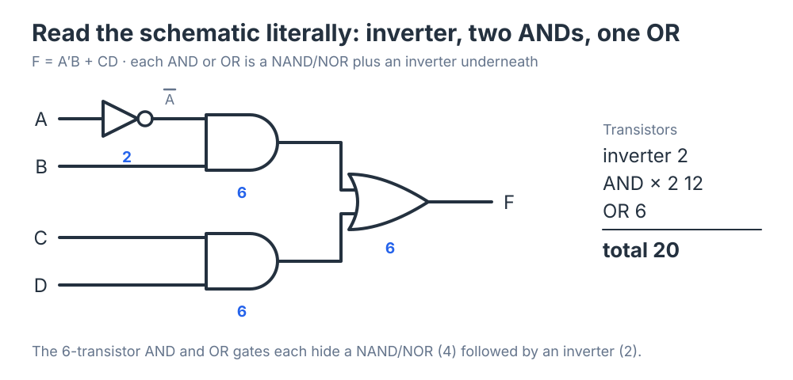
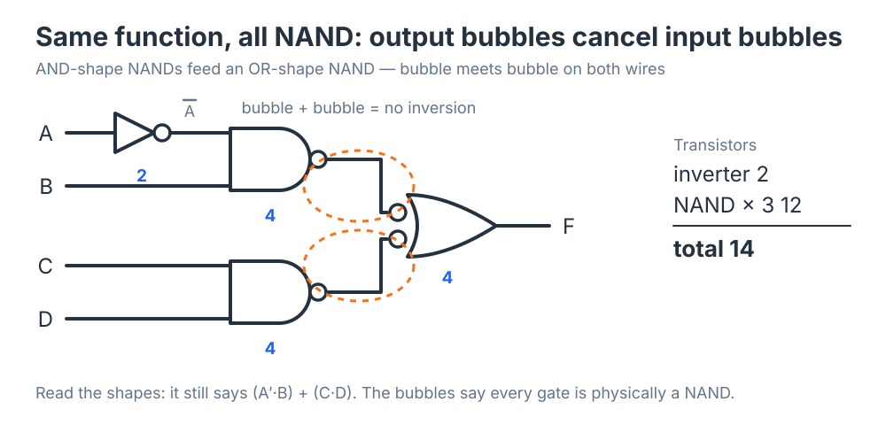

## Schematic Abstraction and Transistor Count

A schematic shows a logic function as an arrangement of gates. It is tempting to read that arrangement as *the* circuit, but it is only one implementation of the function — and usually not the cheapest. Working at the **gate level of abstraction** lets you design and reason without thinking about transistors, and at the same time leaves room to implement the same function with fewer of them. This section makes that concrete: one small function, built two ways, with the transistors counted both times.

## The Example

Take a simple sum-of-products function:

$$F = \bar{A}B + CD.$$

Read it directly and the schematic writes itself. An **inverter** makes $\bar{A}$. An **AND** gate forms the product $\bar{A}B$. A second **AND** gate forms $CD$. An **OR** gate adds the two products to produce $F$. Four gates, drawn exactly as the expression reads:

Nothing about this drawing is wrong. It computes $F$, and it is the picture most people would draw first. The question is what it costs.

## Counting Transistors Directly

The previous section established the CMOS gate costs: an inverter is 2 transistors; a two-input NAND or NOR is 4; and an AND or OR is a NAND or NOR *followed by an inverter*, 6 in all. Count the literal schematic gate by gate:

| Gate | Each | How many | Transistors |
|---|:---:|:---:|---:|
| Inverter (for $\bar{A}$) | 2 | 1 | 2 |
| AND ($\bar{A}B$ and $CD$) | 6 | 2 | 12 |
| OR (combine) | 6 | 1 | 6 |
| **Total** | | | **20** |

Twenty transistors. Notice where twelve of them went: each AND and OR gate is carrying a hidden inverter on its output, two transistors that exist only to undo the inversion that CMOS produces for free.

## A Cheaper Implementation of the Same Function

Because we are free to work at the gate level, we can choose a different set of gates that computes the same $F$. Build it from **NAND gates**. Keep the inverter on $A$. Replace each AND with a NAND — the AND shape with a bubble on its output. Replace the OR with the *other* drawing of a NAND from the previous section: an OR shape with bubbles on both inputs.

Now follow the two internal wires. Each carries a signal that leaves an AND-shape NAND through an output bubble and enters the OR-shape NAND through an input bubble. Bubble meets bubble: two inversions in a row, which cancel. What the OR shape actually receives is $\bar{A}B$ and $CD$, uninverted, and it ORs them. The output is $F$ — the identical function.

This is the *bubble pushing* idea from the schematic-standards material, and it is nothing more than De Morgan's theorem drawn instead of written. In algebra, the same move reads

$$\bar{A}B + CD = \overline{\overline{\bar{A}B} \cdot \overline{CD}},$$

the first form of De Morgan run backwards: an OR of two things equals the NAND of their complements, and the complements are exactly what the two NAND gates already produce. The two NANDs feeding a third NAND is a **NAND-NAND** network, and it is the standard way any sum-of-products expression lands in CMOS.

Count again:

| Element | Each | How many | Transistors |
|---|:---:|:---:|---:|
| Inverter (for $\bar{A}$) | 2 | 1 | 2 |
| NAND | 4 | 3 | 12 |
| **Total** | | | **14** |

**Fourteen transistors instead of twenty** — the same function, 30% smaller. The six that disappeared are exactly the three hidden output inverters in the AND, AND, and OR gates of the literal build. In the NAND version those inversions still happen, but they cancel one another instead of being undone by extra hardware.

## Reading the Two Schematics

The two drawings are worth a second look side by side, because they teach something about how to read any schematic.

In the NAND version the **shapes** have not changed: two AND shapes feeding an OR shape. Anyone reading it still sees "two products, added" — the logical intent is preserved on the page. Only the **bubbles** have changed, and the bubbles say "each of these is physically a NAND." That is the purpose of drawing a NAND as an OR shape with input bubbles rather than as an AND shape with an output bubble: you pick the drawing that makes the *function* legible, and let the bubbles carry the *implementation*.

The first schematic, by contrast, is honest about the function but silent about the cost. Nothing in it shows that each AND and OR hides an inverter. That is not a flaw in the drawing; it is what abstraction means. The gate level deliberately hides the transistor level so that you can think about logic. The price is that a literal reading of a gate-level schematic can be misleading about hardware.

## Why This Matters

Two ideas come out of the example.

**Abstraction.** Most of the time you design and reason at the gate level and do not need to know what is under the hood. The gate symbols are a contract — AND means AND — and you can build correct circuits without ever thinking about transistors. That is a feature: it is how a designer handles a system with millions of gates.

**Optimization.** The contract says nothing about cost, and cost lives one level down. A sum-of-products function implemented as NAND-NAND is cheaper than the literal AND-OR reading, because NAND is the natural CMOS primitive and the AND and OR gates each carry an inversion stage that NAND-NAND lets cancel. Knowing that the mapping exists — even without drawing it every time — is what lets you, or a synthesis tool, choose the leaner realization.

The schematic you draw and the transistors you pay for are at different levels of abstraction. The next section extends the same technique to larger functions and to the all-NOR alternative, and shows when one universal gate fits a function better than the other.

## Key Takeaways

A schematic is one implementation of a function, not the only one. Read literally, $F = \bar{A}B + CD$ is an inverter, two AND gates, and an OR gate — 20 transistors in CMOS, because each AND and OR is a NAND or NOR plus a hidden output inverter. Rebuilt as NAND-NAND — two AND-shape NANDs feeding an OR-shape NAND — the output bubbles cancel the input bubbles (De Morgan's theorem drawn on the page), the shapes still read as the original logic, and the cost is 14 transistors. Working at the gate level of abstraction is what lets you design without thinking about transistors; knowing the NAND mapping exists is what lets the same design be built cheaply.

## Review Questions

### Question 1

Read literally, $F = \bar{A}B + CD$ needs which gates?

A. One inverter, two AND gates, one OR gate\
B. Two inverters and two OR gates\
C. Three NAND gates\
D. One AND gate and one OR gate

### Question 2

In CMOS, why does a two-input AND gate cost 6 transistors when a NAND costs 4?

A. AND gates have wider transistors\
B. An AND is a NAND followed by a 2-transistor inverter\
C. AND gates need a second power supply\
D. The extra transistors buffer the inputs

### Question 3

What is the transistor count of the literal inverter–AND–AND–OR implementation of $F$?

A. 14\
B. 16\
C. 20\
D. 24

### Question 4

In the all-NAND version, why can the OR gate be replaced by a NAND drawn as an OR shape with input bubbles?

A. Because NAND gates are faster than OR gates\
B. Because by De Morgan's theorem an OR of two signals equals the NAND of their complements, and the input bubbles supply the complements\
C. Because the OR gate was redundant\
D. Because bubbles have no effect on the function

### Question 5

Along each internal wire of the NAND version, an output bubble meets an input bubble. What is the effect?

A. The signal is inverted once\
B. The two inversions cancel, so the signal passes through unchanged\
C. An extra inverter is required\
D. The wire must be removed

### Question 6

The NAND-NAND implementation uses 14 transistors instead of 20. Where did the six savings come from?

A. The inverter on $A$ was eliminated\
B. NAND gates use fewer transistors than inverters\
C. The three hidden output inverters inside the AND, AND, and OR gates were no longer needed\
D. One of the gates was removed

## Answer Explanations

**1. A.** Reading the expression as written: $\bar{A}$ needs an inverter, each product needs an AND, and the sum needs an OR.

**2. B.** CMOS produces NAND naturally. To get the AND output the NAND's inversion must be undone by an inverter, adding 2 transistors to the NAND's 4.

**3. C.** Inverter 2, two ANDs at 6 each = 12, one OR at 6: $2 + 12 + 6 = 20$.

**4. B.** De Morgan's first form run backwards: $X + Y = \overline{\bar{X} \cdot \bar{Y}}$. An OR shape with bubbled inputs is exactly a NAND, and the complements it needs are what the preceding NAND gates already produce.

**5. B.** A bubble is an inversion, and two inversions in series cancel. The OR shape receives the uninverted products, so it computes the original sum.

**6. C.** The inverter on $A$ is still there (2 transistors) and the gate count is unchanged; what vanished is the 2-transistor inverter hidden in each of the three AND/OR gates, $3 \times 2 = 6$.
