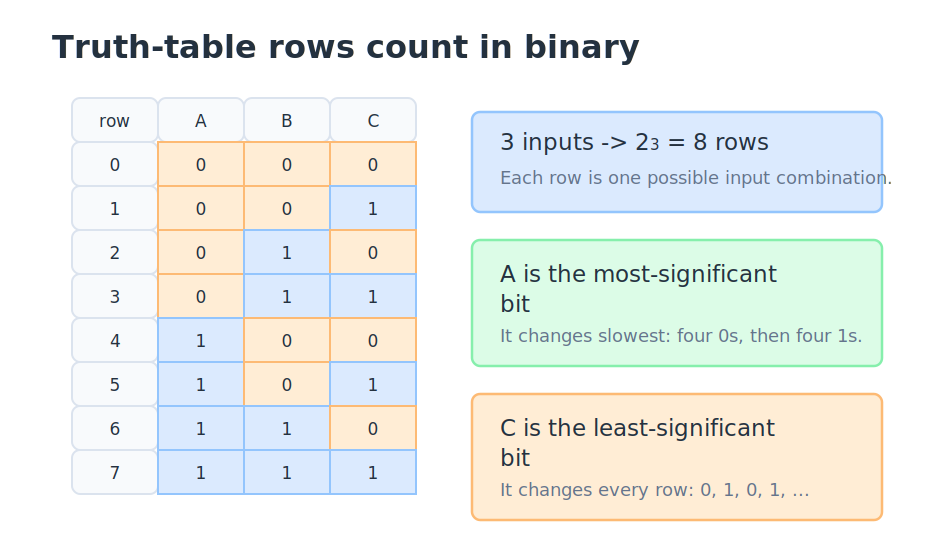
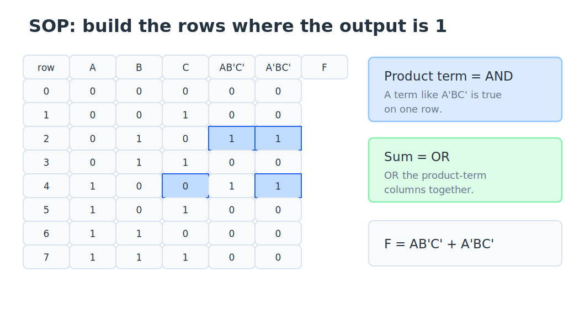
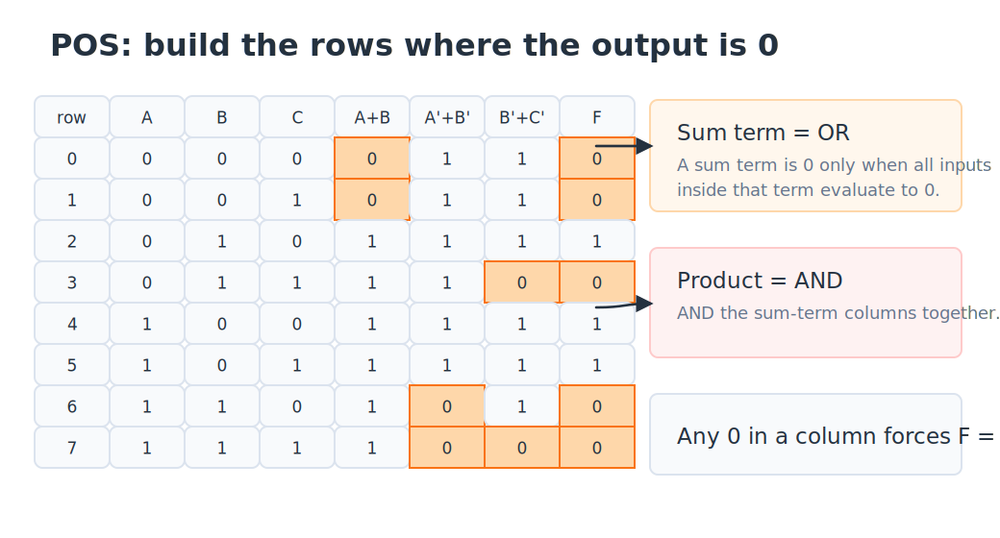
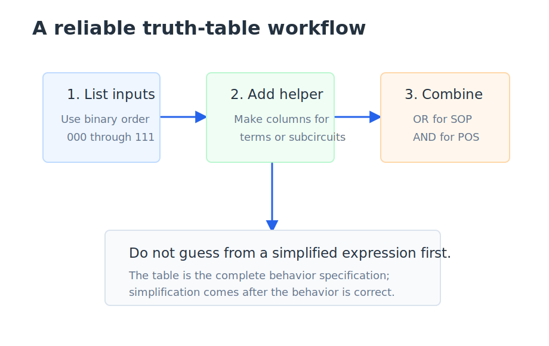

# Truth Tables: Mapping Inputs to Outputs

A **truth table** is a complete description of a digital logic function. It lists every possible input combination and shows what the output should be for each one. If a circuit has inputs named $A$, $B$, and $C$, a truth table answers the question, "What should the circuit do for $000$? What about $001$? What about $010$?" and so on until every combination has been covered.

This matters because digital design is built around precise behavior. A sentence like "turn the alarm on when the sensor is active and the override is not active" is useful, but it still has room for interpretation. A truth table removes that ambiguity. Once the table is correct, you can derive Boolean expressions, draw gates, compare two designs, or simplify the logic while preserving the same behavior.

## Truth Tables Are Complete Specifications

For a circuit with $n$ Boolean inputs, there are $2^n$ possible input combinations. Each input can be either 0 or 1, so every new input doubles the number of rows in the table. One input gives 2 rows, two inputs give 4 rows, three inputs give 8 rows, and four inputs give 16 rows.

The rows should be written in **binary counting order**. For three inputs, the usual convention is to put the variables in alphabetical order from left to right, with the leftmost variable as the most-significant bit and the rightmost variable as the least-significant bit. That gives the row order $000, 001, 010, 011, 100, 101, 110, 111$.

The rightmost column changes fastest because it is the $2^0$ place. In an $A,B,C$ table, $C$ changes every row: 0, 1, 0, 1, and so on. The next column, $B$, changes every two rows. The leftmost input, $A$, changes slowest because it is the most-significant bit. If you build tables in this order every time, your work becomes easier to check, and other people can read your table without guessing which row is which.

> **Key idea:** A truth table is easiest to read when the rows count in standard binary order.

## Reading a Simple Truth Table

Consider a two-input AND gate:

| A | B | $Y = A \cdot B$ |
|---|---|------------------|
| 0 | 0 | 0                |
| 0 | 1 | 0                |
| 1 | 0 | 0                |
| 1 | 1 | 1                |

The table says that $Y$ is 1 only when both inputs are 1. The expression $A \cdot B$ means "$A$ AND $B$." In Boolean algebra, multiplication-like notation is used for AND, so $A \cdot B$, $AB$, and "A AND B" all describe the same operation.

Now compare that with a two-input OR gate:

| A | B | $Y = A + B$ |
|---|---|-------------|
| 0 | 0 | 0           |
| 0 | 1 | 1           |
| 1 | 0 | 1           |
| 1 | 1 | 1           |

The expression $A + B$ means "$A$ OR $B$." In Boolean algebra, addition-like notation is used for OR. This is why later forms are called **sum of products** and **product of sums**: a "sum" is an OR, and a "product" is an AND.

Complements may be written with an overbar or with a prime. For example, $\bar{A}$ and $A'$ both mean NOT $A$. If $A=0$, then $\bar{A}=1$. If $A=1$, then $\bar{A}=0$.

> **Notation:** In this course, $\bar{A}$ and $A'$ both mean the complement of $A$.

## Building a Table from an Expression

One practical way to build a truth table is to add intermediate columns. Suppose the output is

$$F = A\bar{B}\bar{C} + \bar{A}B\bar{C}.$$

This is a **sum of products** expression. Each product term is an AND term, and the plus sign ORs those terms together. Instead of trying to evaluate the whole expression in your head on every row, make one column for $A\bar{B}\bar{C}$, one column for $\bar{A}B\bar{C}$, and then OR those intermediate results to get $F$.

The term $A\bar{B}\bar{C}$ is 1 only on the row $A=1, B=0, C=0$. The term $\bar{A}B\bar{C}$ is 1 only on the row $A=0, B=1, C=0$. Because the full expression ORs those terms, $F$ is 1 on either of those rows and 0 everywhere else.

> **Key idea:** Sum of products identifies where the output should be 1.

Each product term selects one row, or in some cases a group of rows if the term does not mention every variable. The OR operation combines those selected rows into the final output.

## Product of Sums: Think About the Zeros

A **product of sums** expression works from the opposite direction. Each sum term is an OR term, and the full expression ANDs those sum terms together. For example:

$$F = (A+B)(\bar{A}+\bar{B})(\bar{B}+\bar{C}).$$

The easiest way to read POS is to ask where each sum term becomes 0. An OR expression is 0 only when every part inside it is 0. So $A+B$ is 0 only when $A=0$ and $B=0$. The term $\bar{A}+\bar{B}$ is 0 only when $A=1$ and $B=1$, because then both complements are 0. The term $\bar{B}+\bar{C}$ is 0 only when $B=1$ and $C=1$.

After each sum-term column is built, the final step is an AND across the columns. In an AND, any 0 dominates. That means $F$ is 0 anywhere at least one sum-term column is 0. The output is 1 only on rows where every sum term is 1.

> **Key idea:** Product of sums identifies where the output should be 0.

SOP often feels more natural because it lets you point to the rows where the output turns on. POS is just as valid, but it is usually easier to understand if you think of POS as locating the rows where the output must turn off.

## From a Truth Table to an SOP Expression

You can also go in the reverse direction: start with a truth table and write a Boolean expression. For SOP, find every row where the output is 1. Then write one product term for each of those rows.

For this table:

| A | B | C | F |
|---|---|---|---|
| 0 | 0 | 0 | 0 |
| 0 | 0 | 1 | 0 |
| 0 | 1 | 0 | 1 |
| 0 | 1 | 1 | 0 |
| 1 | 0 | 0 | 1 |
| 1 | 0 | 1 | 0 |
| 1 | 1 | 0 | 0 |
| 1 | 1 | 1 | 0 |

The output is 1 on rows $010$ and $100$. Row $010$ means $A=0$, $B=1$, and $C=0$, so the product term is $\bar{A}B\bar{C}$. Row $100$ means $A=1$, $B=0$, and $C=0$, so the product term is $A\bar{B}\bar{C}$. OR those terms together:

$$F = \bar{A}B\bar{C} + A\bar{B}\bar{C}.$$

That expression is not necessarily the simplest possible expression, but it is a correct expression for the table. Simplification is a later step. The first job is to capture the behavior accurately.

> **Design habit:** Capture the behavior first. Simplify only after the truth table or expression is correct.

## A Reliable Workflow

When a truth table starts to feel complicated, slow down and separate the work into small columns. List the input rows first. Then add helper columns for subexpressions, product terms, sum terms, or intermediate signals inside a circuit. Finally, combine those helper columns using the operation in the expression.

This workflow is useful because each column should be easy to reason about. You do not have to mentally evaluate a long expression all at once. You can check one term, one row, and one operation at a time.

There is also an important design habit here: do not simplify before you know the intended behavior. A truth table is the complete behavior specification. Once the table is right, you can simplify or implement the function in several different ways and still have a reference for checking whether the new form behaves the same.

> **Workflow:** List the input rows, build helper columns, then combine those helper columns into the final output.

## Key Takeaways

A truth table lists every possible input combination and the output for each one. With $n$ inputs, there are $2^n$ rows, usually written in binary counting order. In Boolean algebra, a product means AND and a sum means OR. A sum-of-products expression is often read by finding the rows where the output is 1, while a product-of-sums expression is often read by finding the rows where the output is 0. For larger expressions, build helper columns first and then combine them to get the final output.

## Review Questions

1. A truth table has four Boolean inputs. How many input rows does it need?
   A. 4
   B. 8
   C. 16
   D. 32

2. In a three-input table ordered as $A,B,C$, which input normally changes fastest?
   A. $A$
   B. $B$
   C. $C$
   D. All inputs change at the same rate

3. In Boolean algebra, what does the expression $A + B$ mean?
   A. $A$ AND $B$
   B. $A$ OR $B$
   C. $A$ XOR $B$
   D. $A$ NOT $B$

4. Which row makes the product term $\bar{A}B\bar{C}$ equal to 1?
   A. $000$
   B. $010$
   C. $101$
   D. $111$

5. What is the most useful way to think about product-of-sums expressions?
   A. They identify where the output must be 0
   B. They can only describe XOR circuits
   C. They always require fewer gates than SOP
   D. They ignore complemented variables

6. Why are helper columns useful when building a truth table?
   A. They reduce the number of input rows
   B. They allow inputs to be listed in any order
   C. They break a larger expression into smaller pieces that are easier to evaluate
   D. They replace the need for Boolean expressions

## Answer Explanations

1. **C.** Four inputs give $2^4 = 16$ possible input combinations, so the table needs 16 input rows.

2. **C.** In the usual $A,B,C$ order, $C$ is the least-significant bit, so it alternates every row.

3. **B.** In Boolean algebra, plus means OR. The expression $A + B$ is true when $A$ is 1, $B$ is 1, or both are 1.

4. **B.** The term $\bar{A}B\bar{C}$ requires $A=0$, $B=1$, and $C=0$, which is row $010$.

5. **A.** POS is usually easiest to read by finding where each OR term becomes 0, then ANDing the columns together.

6. **C.** Helper columns let you evaluate one term or subcircuit at a time, then combine those intermediate results for the final output.
